### Why do we need to process images?

We need to process images for human perception, for machine perception, transform image for technical purposes and finally for pure entertainment (visual effects).

### Where are the sources of errors and image defects?

Sources of errors and image defects in an image are usually introduced in the image pipeline, such a pipeline is shown below:

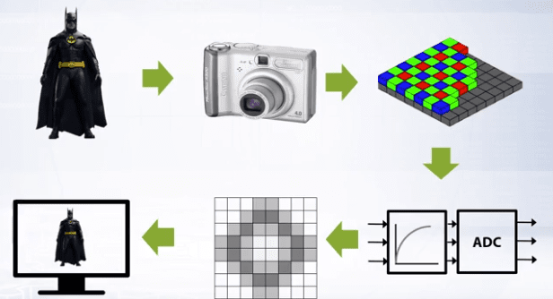

Some of the image defects that can be introduced are:
- low contrast,
- wrong colors,
- noise,
- blur,
- non uniform lighting.

### How can we improve low image contrast?

Brightness correction can improve overall contrast in an image. There are two main reasons for poor image contrast
1. Limited range of sensor sensitivity.
2. Bad sensor transmission function, meaning bad conversion from light energy to perceived pixel brightness. Contrary to popular belief, human perception is subjective so how do we define bad, in this case bad means that these functions defer from the human perception function which works in the brain. Therefore in these conditions you can use different transmission function from brightness to the pixel value.

### How do we evaluate the tone transfer in an image?

We use Brightness histograms to evaluate the tone transfer in an image. The brightness histogram is the chart of brightness distribution in an image.

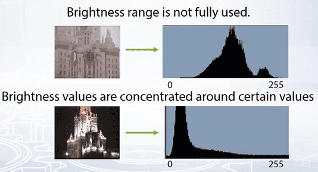

On horizontal axis, brightness varies from black to white, on the vertical axis, the number of pixels absolute or normalized is the respective brightness value.

### How do we improve the contrast in an image?

The most basic technique that can be used is the point operators. These operators map input pixel value to output pixel value and all pixels are processed independently and equally.

The point operator function is written as the  $f^-1$ because we recover true brightness from measurement of brightness.

The most basic operation is linear correction, this is given as:

<MathBlock formula={String.raw`{f^{-1} (y) = (y-y_{min})* \frac{(255-0)}{(y_{max} - y_{min})} \tag{1}}`} />

Linear correction is a point operator that comes compensated of limited histogram range. The idea is to map the lowest brightness value in an image to total black and vice versa.

Below is an example of linear correction:

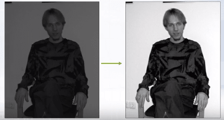

Some images are composed of very dark and very light pixels and such images can't be corrected using linear correction. For those kinds of images we use non linear correction.

### What can we use when linear correction can't be applied?

Gamma transformation is often used for contrast enhancement and it is the most basic type of non linear correction.

This is given as:

<MathBlock formula={String.raw`{y = c \cdot x^{\gamma} \tag{2}}`} />

By controlling the parameter gamma we can control the Gamma transformation.

Below is an example of gamma transformation:

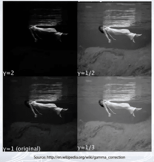

### How can we treat noisy images?

Given a camera and a static scene the easiest way to reduce the noise will be to capture several images and average them, this works because the noise is random and independent. But usually we are presented with only one image, in this case what we do is, we replace each pixel $x$ with weighted average of its local neighborhood. This is given as:

<MathBlock formula={String.raw`{y_{ij} = f([x_{kl}]), x_{kl} \in neighbour(x_{ij}) \tag{3}}`} />

These weights are jointly named as **Filter kernel**. And the simplest case is equal weights and this particular filter is called the Box filter.

### How are Filter Kernels used for Image Processing?

The simplest box filter is the identity filter. Applying this filter for an image will result in no change to the image:

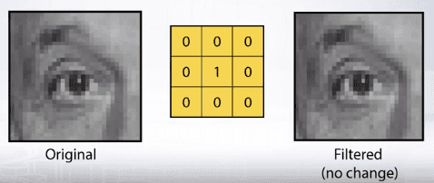

But by moving the 1 in the center of the kernel to other places, the resulting image will be shifted by one pixel.

Generally, any filter kernel with positive weights with sum equal to 1 will be image smoothing filter. This smoothing is what introduces blur to an image.

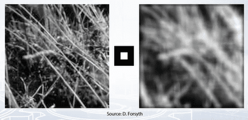

As seen in the image on top, using a box filter introduces edge effects to the image and to eliminate these effects, weight contribution of the neighboring pixels should be according to the closeness to the center:

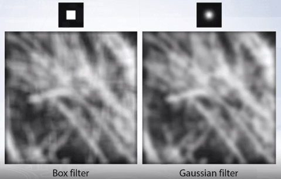

We can set these filter weights according to two dimensional Gaussian distribution, centered at the filter center with arbitrary sigma:

<MathBlock formula={String.raw`{G_{\sigma} = \frac{1}{2 \pi \sigma^2} e^{-\frac{x^2 + y^2}{2 \sigma^2}} \tag{4}}`} />

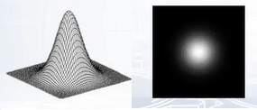

These filters are called the **Gaussian Filters**.

Gaussian filters have infinite support, but discrete filters use finite kernels. For the same sigma, we can build filters of different sizes:

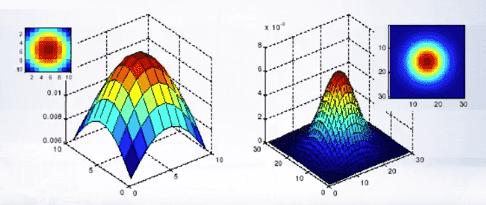

Gaussian filter is the only filter that doesn't add any spurious lines to an image when applied.

Applying Gaussian filter can reduce noise in image but it also blurs the image. The larger the intensity of the noise a larger filter kernel should be used to remove the noise. But the larger the filter, the stronger is the blur. Which leads to a tradeoff between smoothing of the image and reducing the additive noise.

Image convolution can be used to reduce image blur and make the edges more pronounced. This can be done easily as follows:

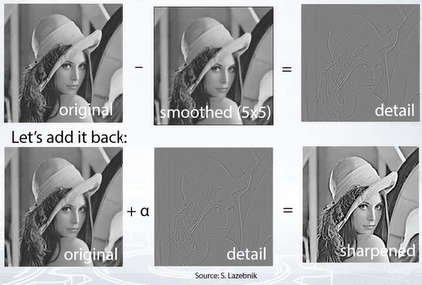

We can combine all of the above operations into a single convolution, approximating it with the Laplacian of Gaussian.

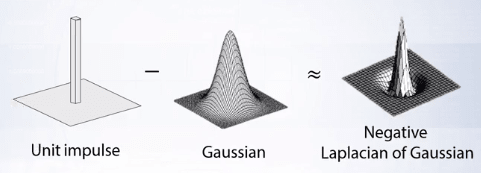

### What is Edge Detection?

The goal of edge detection is to identify sudden changes (discontinuities) in an image. Lines correspond to edges or sudden changes in images. These are more compact than pixels and contain most semantic and shape information and can be used for image recognition.

The edges are points of rapid changes in image intensity, such points can be identified by considering the first derivative of the image intensity and edges will correspond to local extrema of derivative:

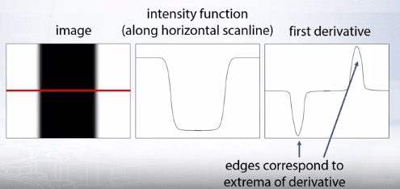

Since image is a two dimensional function, we need to calculate image gradients as vector of potential derivative of image intensity function. So image gradient is a vector given as below:

<MathBlock formula={String.raw`{\Delta f = \left[\frac{\partial f}{\partial x}, \frac{\partial f}{\partial y}\right] \tag{5}}`} />

And the gradient is given by:

<MathBlock formula={String.raw`{\theta = tan^{-1} \left(\frac{\partial f}{\partial y} / \frac{\partial f}{\partial x}\right) \tag{6}}`} />

The *edge strength* is given by the gradient magnitude as:

<MathBlock formula={String.raw`{\parallel \nabla f \parallel = \sqrt{\frac{\partial f^2}{\partial x} + \frac{\partial f^2}{\partial y}} \tag{7}}`} />

Since images are discrete we could approximate partial derivatives with finite differences:

<MathBlock formula={String.raw`{\frac{\partial f}{\partial x} = \frac{f(x_{n+1}, y) - f(x_n, y)}{\Delta x} \tag{8}}`} />

Which can be written as a simple convolution:

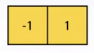

Some examples of other approximations of derivative filters:

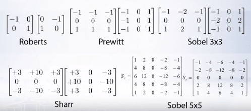

The finite difference filters respond strongly when there is noise in the image. This happens because noise results in pixels that look very different from the neighborhoods which leads to a lot of false responses by the finite difference filters leading to edge disappearance.

The solution then is to apply Gaussian smooths first to reduce the noise and then apply edge detection kernel. Since convolution is associative we can combine both smooth and edge differentiation kernels into one filter kernel.

Gradient Magnitude Estimation is not a complete edge detector because they miss the connectivity information that link neighboring points into real edges. This problem was addressed by Canny Edge Detector.

<Newsletter />

###  What is a Canny Edge Detector?

The Canny Edge Detector has two steps for gradient estimation.

1. Non maximum suppression: During this step, the thin multi pixel of width reaches down to a single pixel width.

This is done by identifying the points in either pixel rows along the image gradient vector. For a point *q* we have maximum if its value is larger than two points *q* and *r*. To get values in *p* and *r* we interpolate from neighbor pixels. In simple terms, the algorithm goes through all the points on the gradient intensity matrix and finds the pixels with the maximum values in the edge direction.

2. Linking Edge pixels together to form continuous boundaries.

This is done by assuming a point as an edge point, then we construct the tangent to the edge curve (which is normal to the gradient in that point) and use this to predict the next points. And we select the point with the largest gradient and link it to the current point. For linking edge points, we use hysteresis. Hysteresis is just two thresholds. We use a high threshold to start edge curves and a low threshold to continue them.

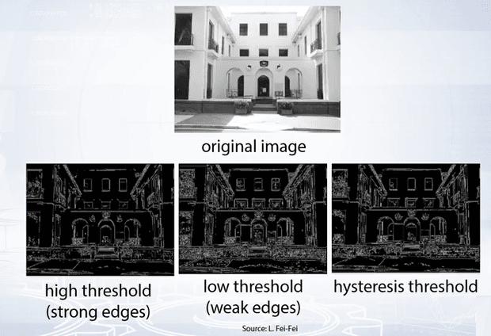

By varying the sigma in gradient computation or the size of Gaussian smoothing or the size of derivative for Gaussian filter. It can detect edges on different scales, large sigma detects large scale edges. Small sigma detects fine features in images.

Change in intensity is not the only source of edge detection. Change in color or texture also gives us visible edges in images. But such changes can't be detected by image gradient or canny operator. Advanced techniques see this as a pixel classification problem and use machine learning techniques. But for many computer vision tasks canny edge detector proves to be sufficient. For example it is often used as a feature extractor and produce features which are later used for image recognition.
