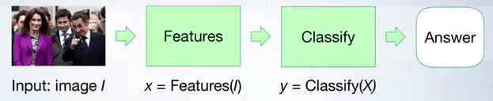
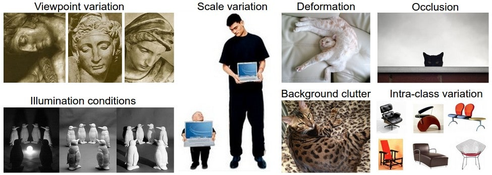
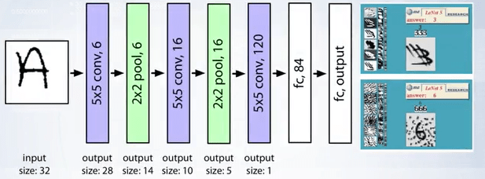
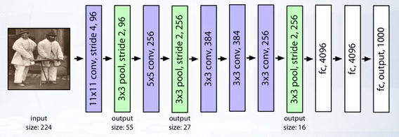
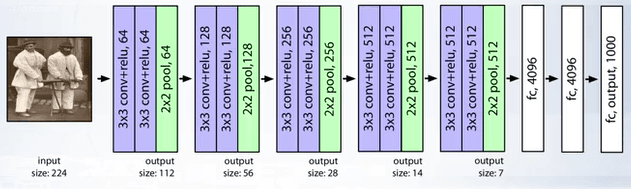
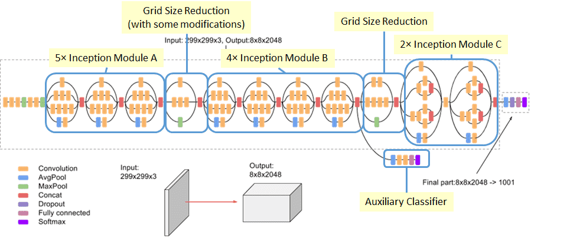
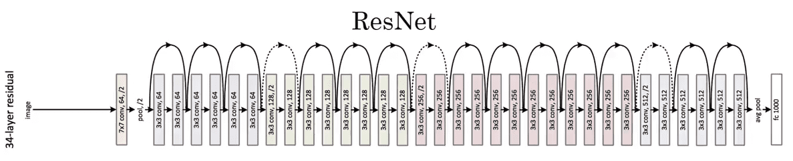
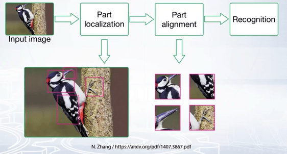

### What is Image Classification?

Understanding the contents of an image or an image region is fundamental to image and scene understanding. Many other vision problems such as object detection and semantic segmentation can be reduced to image classification.

The goal of image classification is to assign the input image one or more labels from some predefined set of categories. Classification can be thought of as two separate problems:

1. Binary Classification: where only two classes are involved.
2. Multi-class Classification: involves assigning an object to one of several classes.

### How does humans perform image classification?

Research has revealed two fundamental aspects influencing the image recognition process. That is, image resolution and duration of image exposure to the viewer. This is replicated in machine learning approach to image classification.

The first step of the pipeline corresponds to extraction and encoding of meaningful features from the image pixels and the second step performs image classification in the space of features extracted from the image.

Machine learning methods for image classification build the decision function over features that are extracted from the image, while deep learning methods learn both the features and the decision functions in an end-to-end fashion.

### What are some challenges in Image Classification?

Humans don't consider image classification as a challenge, even babies are able to classify what they see to an extent, you probably would have seen these funny videos where a baby reacts to seeing his/her father without a beard for the first time, initially the baby doesn't classify the person as their father, meaning, they were able to classify before but for a computer, this task is still a huge challenge.

If you haven't watched the video, you can watch the video [here](https://www.newsflare.com/video/87786/health-education/baby-girl-doesnt-recognise-her-father-without-a-beard), it's adorable but make sure you come back.

So, back to why image classification can be challenging, I list below few of the most common challenges in image classification and if you see the development of image classification algorithms, they are a response to these challenges:

- Viewpoint variant: meaning an object in an image can be captured in many ways respect to the camera.
- Scale variation: images can't represent real world sizes accurately and even among two images, the sizes an object represent can vary.
- Deformation: many objects can be deformed in various ways.
- Occlusion: An object can be covered or hidden by other objects.
- Illumination conditions: Lighting conditions may defer.
- Background clutter: Objects may blend into the background making them hard to identify.
- Intra class variation: An object such as a chair comes in different shapes, sizes and colors and this can be a challenge.

Below is an example for these challenges:

### What are some neural network architectures for computer vision?

- LeNet (1998) : 32x32 gray scale input image, 5-layer convolutional feature extractor.

- AlexNet (2012) : 11x11, 5x5, 3x3 convolutions, max pooling, dropout, data augmentation, ReLU activations, SGD with momentum.

- VGG (2014) : 138 million parameters, 18 layers. Used 3x3 layers for more non linearity and less parameters to learn.

- Inception V3 (2015) : 25 million parameters, 22 layers. The idea of having inception blocks is connected to both the reduction of computational complexity and the efficient use of local image structure. The correlation statistics over the last layer is analyzed and clustered into groups of units with high correlations. In the layers close to the input, correlated units would concentrate in local regions. Thus we would end up with a lot of clusters concentrated in a single region, and then can be covered by a layer of one by one convolutions in the next layer.

The idea of having one by one convolution is that such convolutions can capture interactions of local channels in one pixel of the feature map. They form sort of dimensionality reduction with added ReLU activation that is necessary to remove redundant feature maps from the previous layer.

- ResNet: Deeper models achieve better results in recognition because it allows the network to learn features at various levels of abstraction. But deeper models suffer from vanishing gradients problem and their training error starts increasing due to this resulting in a saturation of accuracy.

ResNet solves this by using something called a skip connection:

<Newsletter />

### What is fine grained Image classification?

Fine grained image classification/recognition classify visually very similar objects. They aim to distinguish objects from different subordinate level categories within a general category. They have high intra-class and low inter-class variance.

Part localization can be used for fine grained image recognition.  What part localization does is it explicitly isolate differences associated with object parts and then classify features extracted from aligned parts.

Dividing the fine-grained dataset into multiple visually similar subsets or directly using multiple neural networks to improve the performance of classification is another widely used method in many deep learning based fine-grained image classification systems.
