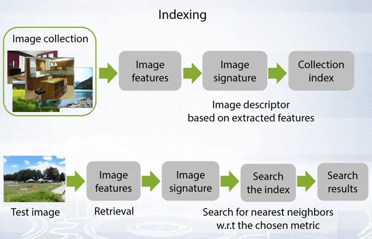
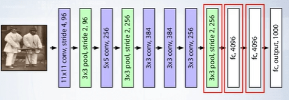
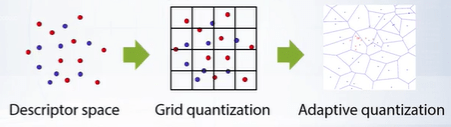
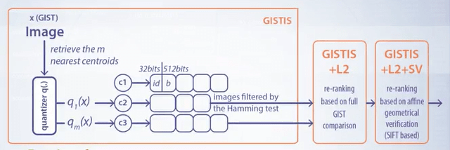

### What is content based image retrieval?

Content based image retrieval is the task of retrieving images from a large database using a query by image content rather than using metadata. The term content in this context might refer to colors, shapes, textures or any other information that can be derived only from the image itself. This bears similarity to [image classification](https://www.adhiraiyan.org/deeplearning/computer-vision-image-classification) and face identification problems, yet focuses on scaling to huge image collections via approximate methods.

Content based image retrieval pipeline is shown below:

### How do you define image similarity?

Image similarity can be defined as:
1. Content feature similarity (eg., color similarity)
2. Near duplicates: subtly changed image (colors, compressed)
3. Object retrieval: Output the same object or scene, meaning larger viewpoint and background variations compared to near duplicated search.
4. Images visually similar by the scene geometry.
5. Category level classification: retrieve images of the same scenes or objects with high visual distinctiveness.

### How do you evaluate a image retrieval method?

The top result is used for each of the query images and then the average precision is calculated.

### Computing semantic image embeddings using convolutional neural networks

To search for a target image, one first needs to compute a semantic representation from raw pixel values. Virtually, every approach to computing features for image classification and recognition has been applied to image retrieval too. Starting from basic color histograms, the research then went on to using gradient histograms, such as HOG or SIFT.

### What are some of the first content based image retrieval systems?

One of the first content-based image retrieval systems was the QBIC system developed at IBM in 1995. This worked in two modes:
1. Image search using color histograms.
2. Image search using object marks specified by user.

### How does Histogram of Gradients work?

Histogram of gradients are features used for image classification. They are computed by splitting the image into block, computing the gradients in each block and aggregating these into histograms. As the histogram is computed for a fixed image resolution, such a descriptor is not ideal for content based image search where objects of interest may be present in the image at different scales. Therefore to describe the image as a whole, GIST descriptor was introduced.

### What is a GIST descriptor?

GIST computes gradients in the image at a variety of scales via primitive scales or Gaussian smoothing with different intensities. For each scale, histograms of gradients are concatenated to form a descriptor to describe color information, while one may use color histogram or simple averaging of colors within blocks.

GIST descriptor is not a large descriptor to work with. What it means is if we were to describe the set of possible key points in the image then each point will be described with a more simple SIFT descriptor with fewer parameters but every image has multiple key points and this scales with the images rending GIST unusable.

Another issue is the retrieval performance. Linear search that considers billions of comparisons renders this performance infeasible. The solution to this is to organize the pre-computed descriptors represented as points in Euclidean space into an efficient data structure favoring the retrieval of nearest neighboring points. The main way to create approximate descriptors is through vector quantization.

### How can we use convolutional neural networks for image retrieval?

If two images produce feature activation vectors with a small Euclidean separation, we can say that the higher levels of the neural network consider them to be similar. The crude image search algorithm that uses deep convolutional neural network works as follows:

Let us fix some layer in the network whose activations are to be used as semantic image features. Then we use the output of layers 5, 6 or 7 in the AlexNet network prior to ReLU transform. These high dimensional vectors represent a deep descriptor or a neural code of an input image. For each image we extract multiple sub-patches of different sizes at different locations whose union covers the whole image. For each computed sub-patch we compute a CNN representation and we compute distances between eah queries sub-patch and the reference sub-patch. Then we average over sub-patches to compute distance between query and reference images.

### What is a compact neural descriptor?

Last convolutional layers are usually high dimensional for example the sixth layer in the ALexNet has a dimension of 4096. Therefore PCA is used to reduce the dimensions to 256 or even 198 dimensions without any quality loss in the case of AlexNet.

Below is the algorithm for a compact neural descriptor ([Babenko et al. ICCV2015])
1. Extract neural codes fom Conv-5: $\Psi_1(I) = Conv_5(I)$
2. Sum-pool each map: <MathBlock formula={String.raw`\Psi_2(I) = \sum_k \sum_l (\Psi_1(I))^{k,l}`} />
3. $L_2$ normalize
4. PCA compression + whitening: $\Psi_3(I) = diag(s_1,\dots,s_N)^{-1} M_{PCA} \Psi_2(I)$
5. $L_2$ normalize

### How does vector quantization for image retrieval work?

We start by mapping the set of all vectors to cluster centroids, equivalent to representing every object wih a number corresponding to a cluster. The simplest possible way to perform clustering is to split the space of descriptors with a uniform grid along each dimension. Yet this is not optimal for image descriptors that will form natural cluster of images with similar content. Thus, some kind of adaptive quantization, such as k-mean quantization is required. K-means quantization splits the space of descriptors into a tessellation using the well know k-means clustering procedure.

After we have clustered the space of descriptors into groups, it is convenient to represent our index in inverted form. We represent the set of descriptors as K lists where each list i contains images clustered into $i_{th}$ cluster.

To query for the image we quantize the query image and find the cluster nearest to the image and then retrieve all of the images in that cluster as approximate nearest neighbor and sort them according to the Euclidean distance to the query image.

### Hashing for image quantization

The idea of semantic hashing is to map image descriptors from Euclidean space to the space of binary codes, that is strings of zeros and ones. In such a way that descriptors close according to Euclidean distance would map to codes close according to the Hamming distance. In information theory, the Hamming distance between two strings of equal length is the number of positions at which the corresponding symbols are different. In other words, it measures the minimum number of substitutions required to change one string into the other, or the minimum number of errors that could have transformed one string into the other. One of the most straightforward algorithms to perform semantic hashing is Locality Sensitive Hashing or LSH.

### How does Locality Sensitive Hashing works?

1. We select a random hyperplane, and then project all of the descriptors in the image collection to that direction.
2. We choose the hyperplane threshold or intercept close to the median of all projects.
3. We set hash for *v* to be $h(v) = sign(h \cdot v)$ .

As each image gets located on either side of the hyperplane, we may mark it with either one or zero according to the sign of those catalog projects between the descriptive vector and the hyperplane normal. LSH algorithm hashes input items so that similar items map to the same buckets with high probability.

### What are the strengths and weaknesses of K-means and LSH?

K-means:

$+$ Adaptive, simple, and intuitive

$-$ Accurate clustering demands large K

$-$ Slow for large sample sizes N

LSH:

$+$ Fast Computation

$-$ Asymptotic approximation, may require long signatures.

<Newsletter />

### GIST IS for indexing large image collections.

An intuitive extension of K-means and LSH would be to combine them into a more efficient data structure for search. Instead of quantizing the original vectors, we may quantize the difference between the vector and its associated cluster. Hence, we will describe the location of a vector within the cluster computed by K-means. We first apply K-means clustering to decompose the entire input set of descriptors into clusters and then apply semantic hashing procedure for each cluster independently. To approximate the difference between the descriptor and the centroid of the cluster, the descriptor got quantized to.

This is how GIST Indexing Structure works.

To retrieve images by query, we first quantize the query descriptor and pick a few hundred closest clusters. In practice, this elects around 2.5% of images instead of ideally picking 1% of that if the distribution of clusters were uniform. Having the cluster selected, we can compute the binary codes for the difference between the image and each of the cluster centers and search through the binary codes for each cluster that we store in memory.

We then select the images whose binary codes differ from the query in less than 200 and 20 bits, for example, that would leave us with approximately 5% of images. In the end, we return images sorted by hamming distance or, alternatively, we may load the original neural codes of the disk and re-rank the search results with respect to the original Euclidean distance between the query and the selected images, which would be fast.

