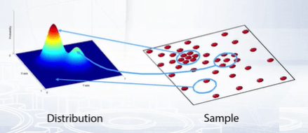
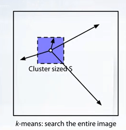
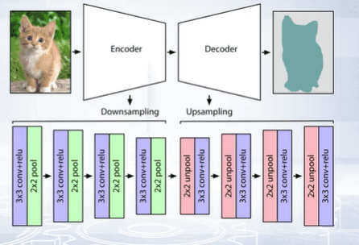
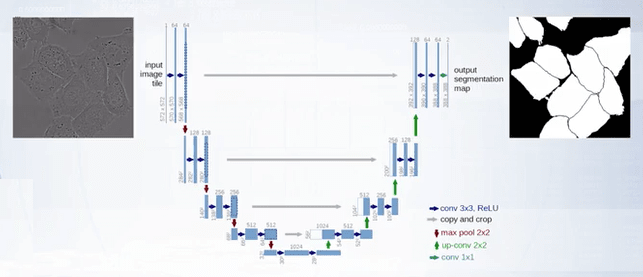

### What is image segmentation?

Image segmentation task is splitting an image into groups of pixels by a certain criterion. As a result, we get compact representation for image data in terms of a set of components that share common visual properties.

### What are the types of image segmentation?

__Semantic segmentation__:

In semantic segmentation each pixel of the image corresponds to a certain class. This labels instances of the same class with the same label. This task is complicated because different pixels of the same object differ significantly from one another in terms of features; brightness, color, or texture. The only thing they have in common is semantics, because they belong to the same identity.

__Instance segmentation__:

Is the task of labeling all individual instances of objects of a given class. The problem can be considered as dividing the image into a background and object, where each object that is not a background is marked with his own label.

__Object extraction__:

Involves selecting an object that is interactively defined by the user or in some other way.

__Co-segmentation__:

We should select the same instance of an object on all images in the collection.

__Unsupervised segmentation__:

Involves grouping image pixels into regions whose statistical characteristics, like color or texture, are homogeneous or stationary and differ from neighboring regions.

### What conditions should the segments satisfy?

1. The segment boundaries must correspond to the boundaries of objects.
2. The segments must be contained entirely within the owner object.
3. Small objects should not be a part of a segment, but should be described by their own segment.
4. The segments should be uniform in terms of visual characteristics.
5. They should be large enough to be informative.
6. They should be compact, meaning, they have about the same size.
7. They are usually evenly distributed over the image and the segmentation algorithm is expected to work in some quick time.

### What is Oversegmentation?

Methods that more or less meet the requirements of segmentation are called oversegmentation or super pixel methods. They're called so because we can segment a region of one object for a larger number of fragments.

Oversegmentation is the process by which the objects being segmented from the background are themselves segmented or fractured into subcomponents.

Methods for image segmentation:
- Heuristic methods like Region growing, in which we specify a set of initial points and gradually attach to these points neighboring pixels that have the same characteristics.
- Split and Merge (Heuristic method), where we divide the image into regions until the resultant regions are homogeneous.
- Graph based methods.
- Energy based methods (Snakes, TurboPixels), where one formulate the segmentation task in the form of optimization of contours and then iteratively updates these contours.
- Probably, the most advanced yet relatively simple approaches are clustering-based ones.

One of the efficient oversegmentation schemes is the Mean shift algorithm.

### How does the mean shift algorithm work?

In Mean shift, one represents every pixel in the image with a feature vector, color, histogram of gradients and pixels of filtered image may serve as features. The idea of this approach is to search the feature space of both pixels for areas with large probability density mass, most of high dimensional feature distribution.

To perform the search for a local density maximum, we examined the neighborhood of every point in the feature space and estimate the local density via the non-parametric estimate known from statistics such as Kernel or Parzen estimates.

We may then compute the shift, the direction in the image where density increases in the feature space.

When the procedure is complete for all points in the sample, we cluster points according to the simplest possible rule. A cluster is a group of points for which the search procedure leads to the same mode of distribution.

Having this in mind, one may note that image segmentation is nothing more than clustering in the feature space represented in pixels.

### How does clustering for image segmentation work?

SLIC or Simple Linear Iterative Clustering is another unsupervised segmentation method which is based on k-means and adopted to image segmentation task. The idea of this algorithm is to compare the pixels that are spaced apart from each other in the image by a distance not more than s.

The hyperparameter s can later adjust the size of super pixels. K-means requires initial approximation of cluster centers. In SLIC, uniformly distributed points separated by the distance s are used.

As in the k-means algorithm, the cluster centers are updated until the summary change in all clusters is less than the operating threshold.

### How does deep learning models for image segmentation work?

Semantic segmentation with convolutional neural network means classifying each pixel in the image. Thus, the idea is to create a map of full-detected object areas in the image.

The naive approach is to reduce the segmentation task to the classification one. The idea is based on the observation that the activation map induced by the hidden layers when passing an image through a CNN could give us a useful information about which pixels have more activation on which class. Our plan is to convert a normal CNN used for classification to a fully convolutional neural network used for segmentation.

1. We get a pre-trained convolutional neural network.
2. We convert the last fully connected layer into a convolutional layer of receptive field one by one. When we do this, we gain some form of localization if we look at where we have more activation.
3. Optionally, we can fine tune the fully convolutional network for solely segmentation task.

Important point to note here is that the loss function we use in this image segmentation scenario is actually still the usual loss function we use for classification, multi-class cross entropy and not something like the L2 loss, like we would normally use when the output is an image. This is because despite what you might think, we're actually just assigning a class to each of our output pixels.

The problem with this approach is that we lose some resolution by just doing this because the activation will downscale on a lot of steps.

Different approach to solving semantic segmentation via deep learning is based on downsampling-upsampling architecture, where both left and right parts have the same size in terms of number of trainable parameters. This approach is also called the encoder-decoder architecture.

### How does Encoder-Decoder architecture for image segmentation work?

The main idea is to get the input image with size, n times m, compress it with a sequence of convolutions, and then decompress it and get the output with the original size, n times m.

To save the information, we could use skip connections or reserve all convolution and pooling layers by applying unpooling and transpose convolution operations in decoder's part, but at the same place as where max pooling and convolution is applied in convolutional part or encoder part of the network.

Actually, the upsampling or transposed convolution forward propagation is a convolution back propagation. And the upsampling back propagation is a convolution forward propagation. The easiest way to obtain the result of a transposed convolution is to apply an equivalent direct convolution. Kernel and stride sizes remain the same. But now, we should use zero padding with appropriate size.

The max pooling operation is not invertible. Different approaches to the inverse of max pooling:
- The easiest way is to use resampling and interpolation. This means, taking an input image, re-scaling it to the desired size, and then calculating the pixel values at each point using an interpolation method, such as bilinear interpolation.
- Restore max pooling as a "Bed of nails" where we either duplicate or fill the empty block with the entry value in the top left corner and the rows elsewhere.
- We record the position called max location switches where we located the biggest values during normal max pooling. And then use their positions to reconstruct the data from the layer above.

<Newsletter />

### How does U-Net for image segmentation work?

U-Net is a downsampling-upsampling architecture.

The downsampling part follows the typical architecture of a convolutional network. It consists of the repeated application of two three-by-three unpadded convolutions followed by a rectifier linear unit and a two-by-two max pooling operation with stride two for downsampling. At each downsamplings tab, we double the number of feature channels.

Every step in the upsampling part consists of a transposed convolution of the feature map followed by a two-by-two convolution that has the number of feature channels and upsamples the data, and concatenates with the correspondingly cropped feature map from the downsampling part, and this is implemented via skip connections. This is then convolved by two three-by-three convolutional layer each followed by a rectifier linear unit. The cropping is necessary due to the loss of border pixels in every convolution. Of the final layer, a one-by-one convolution is used to map each 64-component feature vector to the desired number of classes.
