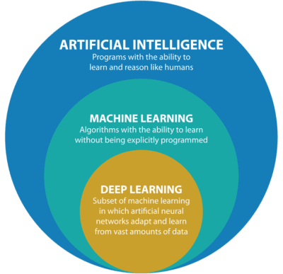
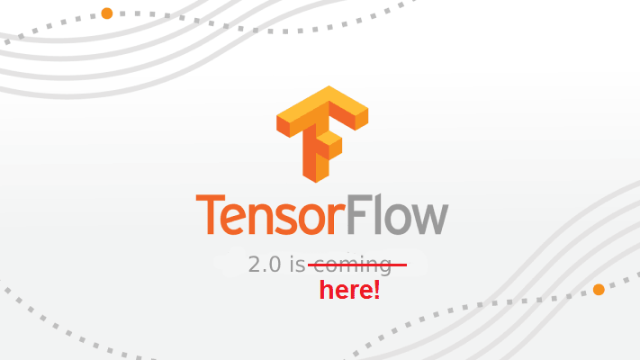
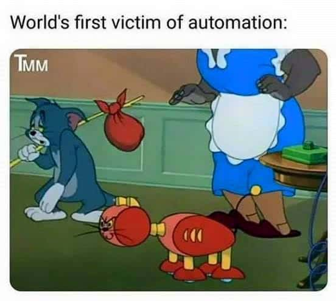
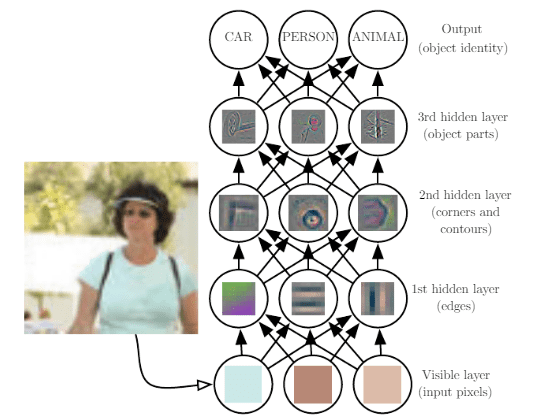
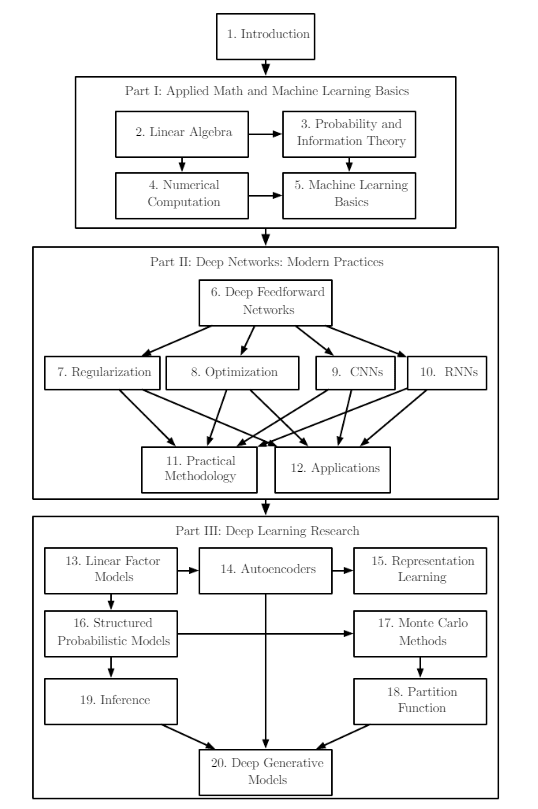
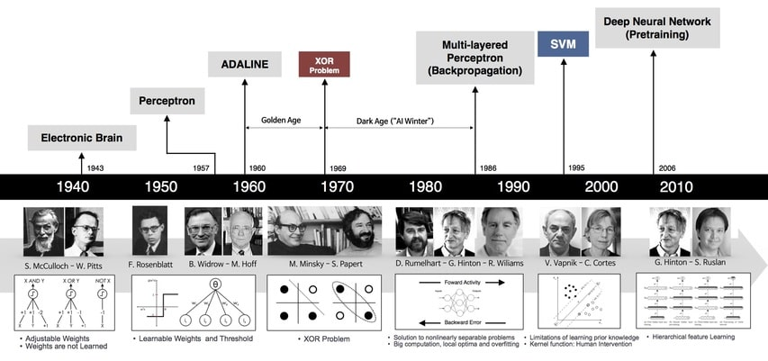

### 01.00 - Preface

#### Deep Learning

The [Deep Learning](https://www.deeplearningbook.org/) textbook is written by Ian Goodfellow, Yoshua Bengio and Aaron Courville, and this book is intended to help students and practitioners enter the field of machine learning in general and deep learning in particular. This is an excellent, comprehensive textbook on deep learning that I found so far and is presented elegantly and rigorously throughout. This is the book that explains what is going on and why so that you will be able to make principled decisions and not just blindly implement things.

The book is mainly separated into three parts:

- Part I: Applied Math and Machine Learning Basics
- Part II: Modern Practical Deep Networks
- Part III: Deep Learning Research

For a detailed view of the chapters see [Index](https://nbviewer.jupyter.org/github/adhiraiyan/DeepLearningWithTF2.0/blob/master/notebooks/Index.ipynb).

This book includes almost everything you need to know to understand deep learning algorithms but this book can be challenging for two reasons.

One, this is a highly theoretical book and is written as an academic text, even though you have a whole part on the Applied Math background, this book still requires additional math background and the authors acknowledge that.

Two, the best way to learn these concepts is by practicing it, working on problems and solving programming examples and after scouring the internet there is no complete exercises or programming guide to this great book.

Which eventually led me to write [Deep Learning with Tensorflow 2.0](https://www.adhiraiyan.org/DeepLearningWithTensorflow.html). My goal is to provide explanations for sections that may seem too complex, summarize those that are not and finally provide programming examples in Tensorflow 2.0.

#### Tensorflow 2.0

The main bottleneck of Tensorflow 1.x was that it had a high learning curve and the declarative type of programming was not very intuitive to those who are used to programming in an imperative programming language like Python.

Tensorflow 2.0 comes with major changes and due to these changes if you are just starting out with Tensorflow, then you are in the best place. You can jump right in and start learning without worrying about Tensorflow 1.x but what is that old saying, those who cannot remember the past are condemned to repeat it. Not to sound ominous but knowing what changed from Tensorflow 1.x to Tensorflow 2.0 will help the new user understand and learn the framework better and in case you end up working with the Tensorflow 1.x code then you need to know how to upgrade to Tensorflow 2.0.

And for those users who had to struggle, like me, with Tensorflow 1.x to learn the framework, I am sorry my friends, you will have to re-learn how to use the new framework and rewrite your codebase but a small consolation is, Tensorflow 1.x is not completely abandoning us, the TensorFlow team has created the tf_upgrade_v2 utility to help transition legacy code to the new API. But conversion tools are not perfect so you still might have to manually change some code. In short TensorFlow 2.0 is backward-incompatible.

The main problem with TensorFlow 1.x was its difficulty in learning, applying and debugging and TensorFlow 2.0 solves it by using:

-  __Eager Execution__:  which is an imperative programming environment that evaluates operations immediately, without building graphs, unlike in Tensorflow 1.x which uses Python as a declarative metaprogramming tool for graphs. In short, the Graph and the graph runtime are both abstracted away, which means no session and no global graph state.

You can read more about the changes between Tensorflow 1.x and Tensorflow 2.0 [here](https://www.tensorflow.org/alpha).

If you didn't understand what graph runtime means, I think this is your first time with Tensorflow so you are lucky.

Now, that we took a look at the past, what's in store for the future. Tensorflow has a comprehensive, flexible ecosystem of tools including __[TensorFlow.js](https://www.tensorflow.org/js/)__ to create new machine learning models and deploy existing models with JavaScript, __[TensorFlow Lite](https://www.tensorflow.org/lite/)__ to run inference on mobile and embedded devices like Android, iOS, Edge TPU, and Raspberry Pi, __[TensorFlow Extended](https://www.tensorflow.org/tfx/)__ to deploy a production-ready machine learning pipeline for training and inference using. This lets researchers push the state-of-the-art in machine learning and developers easily build and deploy and scale machine learning powered applications. Note scale, and who better than Google to teach us about scale.

### 01.01 - Introduction

Humans have been long dreaming about creating machines that think. The desire dates back to at least the time of ancient Greece to figures like Daedalus and Hephaestus and to artificial life like Galatea, Talos, and the famous Pandora. Not the planet in Avatar but the Pandora's box mythos 😉.

And even before programmable computers were invented, people were dreaming about software to automate routine labor, understand speech or images, make diagnoses in medicine.

The first reference to the Artificial Intelligence in Hollywood was back in 1951 in the movie "The day the Earth stood still".
But this is really the worlds first victim of automation:

From early days till now, computers excel at tasks that humans find difficult and the true challenge still remains are those tasks that  humans find easy and feel automatic, like recognizing spoken words or driving.

This book is about a solution to these more intuitive problems.

Depending on your source for learning about Artificial Intelligence and Machine Learning, you may not even be familiar with Machine Learning and Deep Learning as a separate subject because these phrases are often tossed around interchangeably.

Deep Learning is one of the approaches to AI. Read about where Deep Learning fits into AI [here](https://www.adhiraiyan.org/ai/what-it-means-to-have-ai).

In short we allow the computers to learn from experience and understand the world in terms of a hierarchy of concepts. If we draw a graph showing how these concepts are built on top of each other, the graph is deep, with many layers.

The following figure shows how a deep learning system can represent the concept of a person by combining simpler concepts, such as corners and contours which are in turn defined in terms of edges.

### 01.02 - Who should read this book

The book was initially written for two target audience in mind:

1. University students (undergraduate or graduate) learning about machine learning, including those who are beginning a career in deep learning and artificial intelligence research.
2. Software engineers who do not have a machine learning or statistics background but want to rapidly acquire one and begin using deep learning in their product or platform.

My goal is to expand the audience to anyone interested in starting to learn Deep Learning with limited machine learning, statistics, python, and tensorflow background. Please note that I assume you have a basic understanding of Python and when we go deeper into the material the problems we will solve may end up python intensive and during those sections, I will refer to further resources which you can use to learn Python.

Given below is the high-level organization of the book. An arrow from one chapter to another indicates that the former chapter is prerequisite material for understanding the latter.

If you are familiar with certain sections, feel free to skip those.

### 01.03 - A Short History of Deep Learning

Through history, deep learning has been called many names, sounds like the beginning of a mystery novel and for the most part, it was and to an extent, it still is a mystery. During 1940s-1960s deep learning was known as __Cybernetics__, during 1980s-1990s people called it __Connectionism__, and it was resurrected back in 2006 with the name __Deep Learning__.

The origin of Deep learning can be roughly traced back to 1943 when William McCulloch and Walter Pitts published [“A Logical Calculus of Ideas Immanent in Nervous Activity”](https://dl.acm.org/citation.cfm?id=104377) which first outlined the computational model of a neural network, meaning models of how learning happens or could happen in the brain. As a result, one of the names that deep learning has gone by is __Artificial Neural Networks (ANNs)__.

So, if Deep Learning has been around since the 1940s, then why is it only now reaching the mainstream computing audience?

The main two reasons are the availability of enormous amounts of data and the increasing power of affordable graphical processing units (GPUs).

This is by far a complete history of Deep Learning which in itself will take a book so I urge the interested readers to read the chapter [Introduction](https://www.deeplearningbook.org/contents/intro.html) but if you want to jump right in, let's get started with [Linear Algebra](https://www.adhiraiyan.org/deeplearning/02.00-Linear-Algebra).

<Newsletter />
