Before we begin, this is a long notebook, I suggest you to bookmark this and go through the material slowly, you have two weeks before I release the next chapter on Probability and Information Theory on 06.02.2019, so take your time. The best way to learn Linear Algebra is by visualizing the concepts, I tried to give practical examples and plots to help you visualize and as always, if you need more explanations, take it to the comments and I'll get back to you.

So, Let's begin 😈...

### 02.00 - Linear Algebra

Linear algebra is the branch of mathematics concerning linear equations and linear functions and their representations through matrices and vector spaces.

Machine Learning relies heavily on Linear Algebra, so it is essential to understand what vectors and matrices are, what operations you can perform with them, and how they can be useful.

If you are already familiar with linear algebra, feel free to skip this chapter but note that the implementation of certain functions are different between Tensorflow 1.0 and Tensorflow 2.0 so you should atleast skim through the code.

If you have had no exposure at all to linear algebra, this chapter will teach you enough to read this book.

```python
# Installs
!pip install --upgrade tf-nightly-2.0-preview

# Imports
import tensorflow as tf
import sys
import numpy as np
import matplotlib.pyplot as plt
import pandas as pd

"""
If you are running this notebook in Google colab, make sure to upload the helpers.py file to your
session before running it, but if you are running this in Binder, then you
don't have to worry about it. The helpers.py file will be in the notebook
folder in GitHub.

"""
from helpers import vector_plot, plot_transform
```

### 02.01 - Scalars, Vectors, Matrices and Tensors

__Scalars:__ are just a single number. For example temperature, which is denoted by just one number.

__Vectors:__ are an array of numbers. The numbers are arranged in order and we can identify each individual number by its index in that ordering. We can think of vectors as identifying points in space, with each element giving the coordinate along a different axis. In simple terms, a vector is an arrow representing a quantity that has both magnitude and direction wherein the length of the arrow represents the magnitude and the orientation tells you the direction. For example wind, which has a direction and magnitude.

__Matrices:__ A matrix is a 2D-array of numbers, so each element is identified by two indices instead of just one. If a real valued matrix <MathInline formula={String.raw`A`} /> has a height of *m* and a width of *n*, then we say that <MathBlock formula={String.raw`A \in \mathbb{R}^{m \times n}`} />. We identify the elements of the matrix as <MathBlock formula={String.raw`A_{m,n}`} /> where *m* represents the row and *n* represents the column.

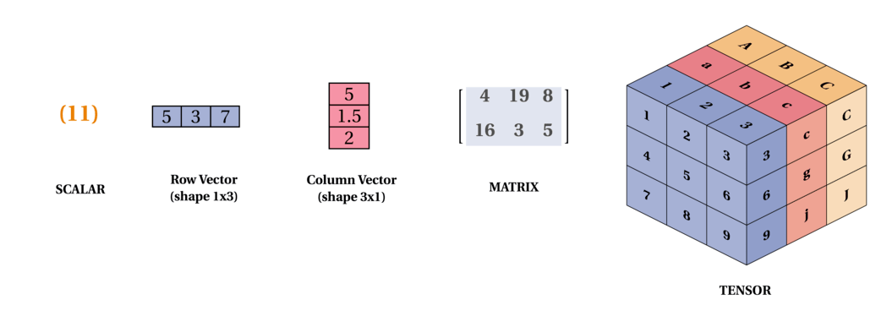

__Tensors:__ In the general case, are an array of numbers arranged on a regular grid with a variable number of axes is knows as a tensor. We identify the elements of a tensor <MathInline formula={String.raw`A`} /> at coordinates(*i, j, k*) by writing <MathBlock formula={String.raw`A_{i, j, k}`} />. But to truly understand tensors, we need to expand the way we think of vectors as only arrows with a magnitude and direction. Remember that a vector can be represented by three components, namely the x, y and z components (basis vectors). If you have a pen and a paper, let's do a small experiment, place the pen vertically on the paper and slant it by some angle and now shine a light from top such that the shadow of the pen falls on the paper, this shadow, represents the x component of the vector "pen" and the height from the paper to the tip of the pen is the y component. Now, let's take these components to describe tensors, imagine, you are Indiana Jones or a treasure hunter and you are trapped in a cube and there are three arrows flying towards you from the three faces (to represent x, y, z axis) of the cube 😬, I know this will be the last thing you would think in such a situation but you can think of those three arrows as vectors pointing towards you from the three faces of the cube and you can represent those vectors (arrows) in x, y and z components, now that is a rank 2 tensor (matrix) with 9 components. Remember that this is a very very simple explanation of tensors. Following is a representation of a tensor:

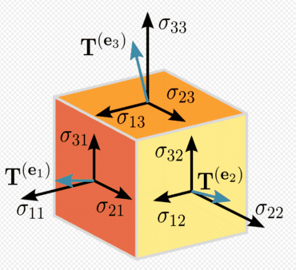

We can add matrices to each other as long as they have the same shape, just by adding their corresponding elements:

<MathBlock formula={String.raw`C = A + B \ where \ C_{i,j} = A_{i,j} + B_{i,j} \tag{1}`} />

If you have trouble viewing the equations in the browser you can also read the chapter in [Jupyter nbviewer](https://nbviewer.jupyter.org/github/adhiraiyan/DeepLearningWithTF2.0/blob/master/notebooks/02.00-Linear-Algebra.ipynb) in its entirety. If not, let's continue.

In tensorflow a:
- Rank 0 Tensor is a Scalar
- Rank 1 Tensor is a Vector
- Rank 2 Tensor is a Matrix
- Rank 3 Tensor is a 3-Tensor
- Rank n Tensor is a n-Tensor

```python
# let's create a ones 3x3 rank 2 tensor
rank_2_tensor_A = tf.ones([3, 3], name='MatrixA')
print("3x3 Rank 2 Tensor A: \n{}\n".format(rank_2_tensor_A))

# let's manually create a 3x3 rank two tensor and specify the data type as float
rank_2_tensor_B = tf.constant([[1, 2, 3], [4, 5, 6], [7, 8, 9]], name='MatrixB', dtype=tf.float32)
print("3x3 Rank 2 Tensor B: \n{}\n".format(rank_2_tensor_B))

# addition of the two tensors
rank_2_tensor_C = tf.add(rank_2_tensor_A, rank_2_tensor_B, name='MatrixC')
print("Rank 2 Tensor C with shape={} and elements: \n{}".format(rank_2_tensor_C.shape, rank_2_tensor_C))
```

<ResultToggle>
```python
3x3 Rank 2 Tensor A:
[[1. 1. 1.]
 [1. 1. 1.]
 [1. 1. 1.]]

3x3 Rank 2 Tensor B:
[[1. 2. 3.]
 [4. 5. 6.]
 [7. 8. 9.]]

Rank 2 Tensor C with shape=(3, 3) and elements:
[[ 2.  3.  4.]
 [ 5.  6.  7.]
 [ 8.  9. 10.]]
```
</ResultToggle>

```python
# Let's see what happens if the shapes are not the same
two_by_three = tf.ones([2, 3])
try:
    incompatible_tensor = tf.add(two_by_three, rank_2_tensor_B)
except:
    print("""Incompatible shapes to add with two_by_three of shape {0} and 3x3 Rank 2 Tensor B of shape {1}
    """.format(two_by_three.shape, rank_2_tensor_B.shape))
```

<ResultToggle>
```python
Incompatible shapes to add with two_by_three of shape (2, 3) and 3x3 Rank 2 Tensor B of shape (3, 3)
```
</ResultToggle>

We can also add a scalar to a matrix or multiply a matrix by a scalar, just by performing that operation on each element of a matrix:

<MathBlock formula={String.raw`D = a \cdot B + c \ where  \ D_{i,j} = a \cdot B_{i,j} + c \tag{2}`} />

```python
# Create scalar a, c and Matrix B
rank_0_tensor_a = tf.constant(2, name="scalar_a", dtype=tf.float32)
rank_2_tensor_B = tf.constant([[1, 2, 3], [4, 5, 6], [7, 8, 9]], name='MatrixB', dtype=tf.float32)
rank_0_tensor_c = tf.constant(3, name="scalar_c", dtype=tf.float32)

# multiplying aB
multiply_scalar = tf.multiply(rank_0_tensor_a, rank_2_tensor_B)
# adding aB + c
rank_2_tensor_D = tf.add(multiply_scalar, rank_0_tensor_c, name="MatrixD")

print("""Original Rank 2 Tensor B: \n{0} \n\nScalar a: {1}
Rank 2 Tensor for aB: \n{2} \n\nScalar c: {3} \nRank 2 Tensor D = aB + c: \n{4}
""".format(rank_2_tensor_B, rank_0_tensor_a, multiply_scalar, rank_0_tensor_c, rank_2_tensor_D))
```

<ResultToggle>
```python
Original Rank 2 Tensor B:
[[1. 2. 3.]
 [4. 5. 6.]
 [7. 8. 9.]]

Scalar a: 2.0
Rank 2 Tensor for aB:
[[ 2.  4.  6.]
 [ 8. 10. 12.]
 [14. 16. 18.]]

Scalar c: 3.0
Rank 2 Tensor D = aB + c:
[[ 5.  7.  9.]
 [11. 13. 15.]
 [17. 19. 21.]]
```
</ResultToggle>

One important operation on matrices is the __transpose__. The transpose of a matrix is the mirror image of the matrix across a diagonal line, called the __main diagonal__. We denote the transpose of a matrix <MathInline formula={String.raw`A`} /> as <MathBlock formula={String.raw`A^{\top}`} /> and is defined as such: <MathBlock formula={String.raw`(A^{\top})_{i, j} = A_{j, i}`} />

```python
# Creating a Matrix E
rank_2_tensor_E = tf.constant([[1, 2, 3], [4, 5, 6]])
# Transposing Matrix E
transpose_E = tf.transpose(rank_2_tensor_E, name="transposeE")

print("""Rank 2 Tensor E of shape: {0} and elements: \n{1}\n
Transpose of Rank 2 Tensor E of shape: {2} and elements: \n{3}""".format(rank_2_tensor_E.shape, rank_2_tensor_E, transpose_E.shape, transpose_E))
```

<ResultToggle>
```python
Rank 2 Tensor E of shape: (2, 3) and elements:
[[1 2 3]
 [4 5 6]]

Transpose of Rank 2 Tensor E of shape: (3, 2) and elements:
[[1 4]
 [2 5]
 [3 6]]
```
</ResultToggle>

In deep learning we allow the addition of matrix and a vector, yielding another matrix where <MathInline formula={String.raw`C_{i, j} = A_{i, j} + b_{j}`} />. In other words, the vector <MathInline formula={String.raw`b`} /> is added to each row of the matrix. This implicit copying of <MathInline formula={String.raw`b`} /> to many locations is called __broadcasting__

```python
# Creating a vector b
rank_1_tensor_b = tf.constant([[4.], [5.], [6.]])
# Broadcasting a vector b to a matrix A such that it yields a matrix F = A + b
rank_2_tensor_F = tf.add(rank_2_tensor_A, rank_1_tensor_b, name="broadcastF")

print("""Rank 2 tensor A: \n{0}\n \nRank 1 Tensor b: \n{1}
\nRank 2 tensor F = A + b:\n{2}""".format(rank_2_tensor_A, rank_1_tensor_b, rank_2_tensor_F))
```

<ResultToggle>
```python
Rank 2 tensor A:
[[1. 1. 1.]
 [1. 1. 1.]
 [1. 1. 1.]]

Rank 1 Tensor b:
[[4.]
 [5.]
 [6.]]

Rank 2 tensor F = A + b:
[[5. 5. 5.]
 [6. 6. 6.]
 [7. 7. 7.]]
```
</ResultToggle>

### 02.02 - Multiplying Matrices and Vectors

To define the matrix product of matrices <MathInline formula={String.raw`A \ \text{and} \ B, \ A`} /> must have the same number of columns as <MathInline formula={String.raw`B`} />. If <MathInline formula={String.raw`A`} /> is of shape *m x n* and <MathInline formula={String.raw`B`} /> is of shape *n x p*, then <MathInline formula={String.raw`C`} /> is of shape *m x p*.

<MathBlock formula={String.raw`C_{i, j} = \displaystyle\sum_k A_{i, k} B_{k, j} \tag{3}`} />

If you do not recall how matrix multiplication is performed, take a look at:

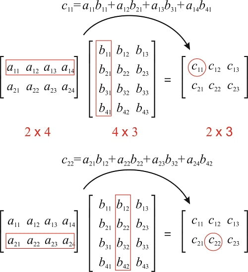

```python
# Matrix A and B with shapes (2, 3) and (3, 4)
mmv_matrix_A = tf.ones([2, 3], name="matrix_A")
mmv_matrix_B = tf.constant([[1, 2, 3, 4], [1, 2, 3, 4], [1, 2, 3, 4]], name="matrix_B", dtype=tf.float32)

# Matrix Multiplication: C = AB with C shape (2, 4)
matrix_multiply_C = tf.matmul(mmv_matrix_A, mmv_matrix_B, name="matrix_multiply_C")

print("""Matrix A: shape {0} \nelements: \n{1} \n\nMatrix B: shape {2} \nelements: \n{3}
\nMatrix C: shape {4} \nelements: \n{5}""".format(mmv_matrix_A.shape, mmv_matrix_A, mmv_matrix_B.shape, mmv_matrix_B, matrix_multiply_C.shape, matrix_multiply_C))
```

<ResultToggle>
```python
Matrix A: shape (2, 3)
elements:
[[1. 1. 1.]
 [1. 1. 1.]]

Matrix B: shape (3, 4)
elements:
[[1. 2. 3. 4.]
 [1. 2. 3. 4.]
 [1. 2. 3. 4.]]

Matrix C: shape (2, 4)
elements:
[[ 3.  6.  9. 12.]
 [ 3.  6.  9. 12.]]
```
</ResultToggle>

To get a matrix containing the product of the individual elements, we use __element wise product__ or __Hadamard product__ and is denoted as <MathInline formula={String.raw`A \odot B`} />.

```python
"""
Note that we use multiply to do element wise matrix multiplication and matmul
to do matrix multiplication
"""
# Creating new Matrix A and B with shapes (3, 3)
element_matrix_A = tf.ones([3, 3], name="element_matrix_A")
element_matrix_B = tf.constant([[1, 2, 3], [4, 5, 6], [7, 8, 9]], name="element_matrix_B", dtype=tf.float32)

# Element wise multiplication of Matrix A and B
element_wise_C = tf.multiply(element_matrix_A, element_matrix_B, name="element_wise_C")

print("""Matrix A: shape {0} \nelements: \n{1} \n\nMatrix A: shape {2} \nelements: \n{3}\n
Matrix C: shape {4} \nelements: \n{5}""".format(element_matrix_A.shape, element_matrix_A, element_matrix_B.shape, element_matrix_B, element_wise_C.shape, element_wise_C))
```

<ResultToggle>
```python
Matrix A: shape (3, 3)
elements:
[[1. 1. 1.]
 [1. 1. 1.]
 [1. 1. 1.]]

Matrix A: shape (3, 3)
elements:
[[1. 2. 3.]
 [4. 5. 6.]
 [7. 8. 9.]]

Matrix C: shape (3, 3)
elements:
[[1. 2. 3.]
 [4. 5. 6.]
 [7. 8. 9.]]
```
</ResultToggle>

To compute the dot product between <MathInline formula={String.raw`A`} /> and <MathInline formula={String.raw`B`} /> we compute <MathInline formula={String.raw`C_{i, j}`} /> as the dot product between row *i* of <MathInline formula={String.raw`A`} /> and column *j* of <MathInline formula={String.raw`B`} />.

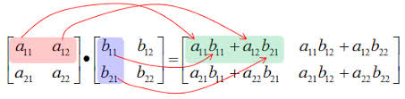

```python
# Creating Matrix A and B with shapes (3, 3)
dot_matrix_A = tf.ones([3, 3], name="dot_matrix_A")
dot_matrix_B = tf.constant([[1, 2, 3], [4, 5, 6], [7, 8, 9]], name="dot_matrix_B", dtype=tf.float32)

# Dot product of A and B
dot_product_C = tf.tensordot(dot_matrix_A, dot_matrix_B, axes=1, name="dot_product_C")

print("""Matrix A: shape {0} \nelements: \n{1} \n\nMatrix B: shape {2} \nelements: \n{3}\n
Matrix C: shape {4} \nelements: \n{5}""".format(dot_matrix_A.shape, dot_matrix_A, dot_matrix_B.shape, dot_matrix_B, dot_product_C.shape, dot_product_C))
```

<ResultToggle>
```python
Matrix A: shape (3, 3)
elements:
[[1. 1. 1.]
 [1. 1. 1.]
 [1. 1. 1.]]

Matrix B: shape (3, 3)
elements:
[[1. 2. 3.]
 [4. 5. 6.]
 [7. 8. 9.]]

Matrix C: shape (3, 3)
elements:
[[12. 15. 18.]
 [12. 15. 18.]
 [12. 15. 18.]]
```
</ResultToggle>

Some properties of matrix multiplication (Distributive Property):

<MathBlock formula={String.raw`A(B +C) = AB + AC \tag{4}`} />

```python
# Common Matrices to check all the matrix Properties
matrix_A = tf.constant([[1, 2], [3, 4]], name="matrix_a")
matrix_B = tf.constant([[5, 6], [7, 8]], name="matrix_b")
matrix_C = tf.constant([[9, 1], [2, 3]], name="matrix_c")
```

```python
# Distributive Property
print("Matrix A: \n{} \n\nMatrix B: \n{} \n\nMatrix C: \n{}\n".format(matrix_A, matrix_B, matrix_C))

# AB + AC
distributive_RHS = tf.add(tf.matmul(matrix_A, matrix_B), tf.matmul(matrix_A, matrix_C), name="RHS")

# A(B+C)
distributive_LHS = tf.matmul(matrix_A, (tf.add(matrix_B, matrix_C)), name="LHS")

"""
Following is another way a conditional statement can be implemented from tensorflow
This might not seem very useful now but I want to introduce it here so you can
figure out how it works for a simple example.
"""
# To compare each element in the matrix, you need to reduce it first and check if it's equal
predictor = tf.reduce_all(tf.equal(distributive_RHS, distributive_LHS))

# condition to act on if predictor is True
def true_print(): print("""Distributive property is valid
RHS: AB + AC: \n{} \n\nLHS: A(B+C): \n{}""".format(distributive_RHS, distributive_LHS))

# condition to act on if predictor is False
def false_print(): print("""You Broke the Distributive Property of Matrix
RHS: AB + AC: \n{} \n\nis NOT Equal to LHS: A(B+C): \n{}""".format(distributive_RHS, distributive_LHS))

tf.cond(predictor, true_print, false_print)
```

<ResultToggle>
```python
Matrix A:
[[1 2]
 [3 4]]

Matrix B:
[[5 6]
 [7 8]]

Matrix C:
[[9 1]
 [2 3]]

Distributive property is valid
RHS: AB + AC:
[[32 29]
 [78 65]]

LHS: A(B+C):
[[32 29]
 [78 65]]
```
</ResultToggle>

Some properties of matrix multiplication (Associative property):

<MathBlock formula={String.raw`A(BC) = (AB)C \tag{5}`} />

```python
# Associative property
print("Matrix A: \n{} \n\nMatrix B: \n{} \n\nMatrix C: \n{}\n".format(matrix_A, matrix_B, matrix_C))

# (AB)C
associative_RHS = tf.matmul(tf.matmul(matrix_A, matrix_B), matrix_C)

# A(BC)
associative_LHS = tf.matmul(matrix_A, tf.matmul(matrix_B, matrix_C))

# To compare each element in the matrix, you need to reduce it first and check if it's equal
predictor = tf.reduce_all(tf.equal(associative_RHS, associative_LHS))

# condition to act on if predictor is True
def true_print(): print("""Associative property is valid
RHS: (AB)C: \n{} \n\nLHS: A(BC): \n{}""".format(associative_RHS, associative_LHS))

# condition to act on if predictor is False
def false_print(): print("""You Broke the Associative Property of Matrix
RHS: (AB)C: \n{} \n\nLHS: A(BC): \n{}""".format(associative_RHS, associative_LHS))

tf.cond(predictor, true_print, false_print)
```

<ResultToggle>
```python
Matrix A:
[[1 2]
 [3 4]]

Matrix B:
[[5 6]
 [7 8]]

Matrix C:
[[9 1]
 [2 3]]

Associative property is valid
RHS: (AB)C:
[[215  85]
 [487 193]]

LHS: A(BC):
[[215  85]
 [487 193]]
```
</ResultToggle>

Some properties of matrix multiplication (Matrix multiplication is not commutative):

<MathBlock formula={String.raw`AB \neq BA \tag{6}`} />

```python
# Matrix multiplication is not commutative
print("Matrix A: \n{} \n\nMatrix B: \n{}\n".format(matrix_A, matrix_B))

# Matrix A times B
commutative_RHS = tf.matmul(matrix_A, matrix_B)

# Matrix B times A
commutative_LHS = tf.matmul(matrix_B, matrix_A)

predictor = tf.logical_not(tf.reduce_all(tf.equal(commutative_RHS, commutative_LHS)))
def true_print(): print("""Matrix Multiplication is not commutative
RHS: (AB): \n{} \n\nLHS: (BA): \n{}""".format(commutative_RHS, commutative_LHS))

def false_print(): print("""You made Matrix Multiplication commutative
RHS: (AB): \n{} \n\nLHS: (BA): \n{}""".format(commutative_RHS, commutative_LHS))

tf.cond(predictor, true_print, false_print)
```

<ResultToggle>
```python
Matrix A:
[[1 2]
 [3 4]]

Matrix B:
[[5 6]
 [7 8]]

Matrix Multiplication is not commutative
RHS: (AB):
[[19 22]
 [43 50]]

LHS: (BA):
[[23 34]
 [31 46]]
```
</ResultToggle>

Some properties of matrix multiplication (Transpose):

<MathBlock formula={String.raw`(AB)^{\top} = B^{\top} A^{\top} \tag{7}`} />

```python
# Transpose of a matrix
print("Matrix A: \n{} \n\nMatrix B: \n{}\n".format(matrix_A, matrix_B))

# Tensorflow transpose function
transpose_RHS = tf.transpose(tf.matmul(matrix_A, matrix_B))

# If you are doing matrix multiplication tf.matmul has a parameter to take the tranpose and then matrix multiply
transpose_LHS = tf.matmul(matrix_B, matrix_A, transpose_a=True, transpose_b=True)

predictor = tf.reduce_all(tf.equal(transpose_RHS, transpose_LHS))
def true_print(): print("""Transpose property is valid
RHS: (AB):^T \n{} \n\nLHS: (B^T A^T): \n{}""".format(transpose_RHS, transpose_LHS))

def false_print(): print("""You Broke the Transpose Property of Matrix
RHS: (AB):^T \n{} \n\nLHS: (B^T A^T): \n{}""".format(transpose_RHS, transpose_LHS))

tf.cond(predictor, true_print, false_print)
```

<ResultToggle>
```python
Matrix A:
[[1 2]
[3 4]]

Matrix B:
[[5 6]
 [7 8]]

Transpose property is valid
RHS: (AB):^T
[[19 43]
 [22 50]]

LHS: (B^T A^T):
[[19 43]
 [22 50]]
```
</ResultToggle>

### 02.03 - Identity and Inverse Matrices

Linear algebra offers a powerful tool called __matrix inversion__ that enables us to analytically solve <MathInline formula={String.raw`Ax = b`} /> for many values of <MathInline formula={String.raw`A`} />.

To describe matrix inversion, we first need to define the concept of an __identity matrix__. An identity matrix is a matrix that does not change any vector when we multiply that vector by that matrix.

Such that:

<MathBlock formula={String.raw`I_n \in \mathbb{R}^{n \times n} \ \text{and} \ \forall x \in \mathbb{R}^n, I_n x = x \tag{8}`} />

The structure of the identity matrix is simple: all the entries along the main diagonal are 1, while all the other entries are zero.

```python
# let's create a identity matrix I
identity_matrix_I = tf.eye(3, 3, dtype=tf.float32, name='IdentityMatrixI')
print("Identity matrix I: \n{}\n".format(identity_matrix_I))

# let's create a 3x1 vector x
iim_vector_x = tf.constant([[4], [5], [6]], name='Vector_x', dtype=tf.float32)
print("Vector x: \n{}\n".format(iim_vector_x))

# Ix will result in x
iim_matrix_C = tf.matmul(identity_matrix_I, iim_vector_x, name='MatrixC')
print("Matrix C from Ix: \n{}".format(iim_matrix_C))
```

<ResultToggle>
```python
Identity matrix I:
[[1. 0. 0.]
 [0. 1. 0.]
 [0. 0. 1.]]

Vector x:
[[4.]
 [5.]
 [6.]]

Matrix C from Ix:
[[4.]
 [5.]
 [6.]]
```
</ResultToggle>

The __matrix inverse__ of <MathInline formula={String.raw`A`} /> is denoted as <MathInline formula={String.raw`A^{-1}`} />, and it is defined as the matrix such that:

<MathBlock formula={String.raw`A^{-1} A = I_n \tag{9}`} />

```python
iim_matrix_A = tf.constant([[2, 3], [2, 2]], name='MatrixA', dtype=tf.float32)

try:
    # Tensorflow function to take the inverse
    inverse_matrix_A = tf.linalg.inv(iim_matrix_A)

    # Creating a identity matrix using tf.eye
    identity_matrix = tf.eye(2, 2, dtype=tf.float32, name="identity")

    iim_RHS = identity_matrix
    iim_LHS = tf.matmul(inverse_matrix_A, iim_matrix_A, name="LHS")

    predictor = tf.reduce_all(tf.equal(iim_RHS, iim_LHS))
    def true_print(): print("""A^-1 times A equals the Identity Matrix
Matrix A: \n{0} \n\nInverse of Matrix A: \n{1} \n\nRHS: I: \n{2} \n\nLHS: A^(-1) A: \n{3}""".format(iim_matrix_A, inverse_matrix_A, iim_RHS, iim_LHS))
    def false_print(): print("Condition Failed")
    tf.cond(predictor, true_print, false_print)

except:
    print("""A^-1 doesnt exist
    Matrix A: \n{} \n\nInverse of Matrix A: \n{} \n\nRHS: I: \n{}
    \nLHS: (A^(-1) A): \n{}""".format(iim_matrix_A, inverse_matrix_A, iim_RHS, iim_LHS))
```

<ResultToggle>
```python
A^-1 times A equals the Identity Matrix
Matrix A:
[[2. 3.]
 [2. 2.]]

Inverse of Matrix A:
[[-1.   1.5]
 [ 1.  -1. ]]

RHS: I:
[[1. 0.]
 [0. 1.]]

LHS: A^(-1) A:
[[1. 0.]
 [0. 1.]]
```
</ResultToggle>

If you try different values for Matrix A, you will see that, not all <MathInline formula={String.raw`A`} /> has an inverse and we will discuss the conditions for the existence of <MathInline formula={String.raw`A^{-1}`} /> in the following section.

We can then solve the equation <MathInline formula={String.raw`Ax = b`} /> as:

<MathBlock formula={String.raw`{A^{-1} Ax = A^{-1} b} \\
{I_n x = A^{-1} b} \\
{x  =A^{-1} b \tag{10}}`} />

This process depends on it being possible to find <MathInline formula={String.raw`A^{-1}`} />.

We can calculate the inverse of a matrix by:

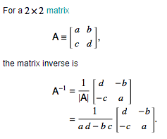

Lets see how we can solve a simple linear equation: 2x + 3y = 6 and 4x + 9y = 15

```python
# The above system of equation can be written in the matrix format as:
sys_matrix_A = tf.constant([[2, 3], [4, 9]], dtype=tf.float32)
sys_vector_B = tf.constant([[6], [15]], dtype=tf.float32)
print("Matrix A: \n{} \n\nVector B: \n{}\n".format(sys_matrix_A, sys_vector_B))

# now to solve for x: x = A^(-1)b
sys_x = tf.matmul(tf.linalg.inv(sys_matrix_A), sys_vector_B)
print("Vector x is: \n{} \nWhere x = {} and y = {}".format(sys_x, sys_x[0], sys_x[1]))
```

<ResultToggle>
```python
Matrix A:
[[2. 3.]
 [4. 9.]]

Vector B:
[[ 6.]
 [15.]]

Vector x is:
[[1.5]
 [1. ]]
Where x = [1.5] and y = [1.]
```
</ResultToggle>

### 02.04 - Linear Dependence and Span

For <MathInline formula={String.raw`A^{-1}`} /> to exits, <MathInline formula={String.raw`Ax = b`} /> must have exactly one solution for every value of <MathInline formula={String.raw`b`} />. It is also possible for the system of equations to have no solutions or infinitely many solutions for some values of <MathInline formula={String.raw`b`} />. This is simply because we are dealing with linear systems and two lines can't cross more than once. So, they can either cross once, cross never, or have infinite crossing, meaning the two lines are superimposed.

Hence if both <MathInline formula={String.raw`x`} /> and <MathInline formula={String.raw`y`} /> are solutions then:

<MathInline formula={String.raw`z = \alpha x + (1 - \alpha)y`} /> is also a solution for any real <MathInline formula={String.raw`\alpha`} />

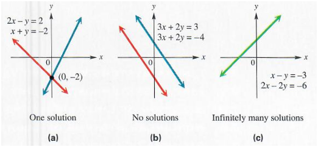

The span of a set of vectors is the set of all linear combinations of the vectors. Formally, a __linear combination__ of some set of vectors
<MathInline formula={String.raw`\{ v^1, \cdots, v^n\}`} /> is given by multiplying each vecor <MathInline formula={String.raw`v^{(i)}`} /> by a corresponding scalar coefficient and adding the results:

<MathBlock formula={String.raw`\displaystyle\sum_i c_i v^{(i)} \tag{11}`} />

Determining whether <MathInline formula={String.raw`Ax = b`} /> has a solution thus amounts to testing whether <MathInline formula={String.raw`b`} /> is in the span of the columns of <MathInline formula={String.raw`A`} />. This particular span is known as the __column space__ or the __range__, of <MathInline formula={String.raw`A`} />.

In order for the system <MathInline formula={String.raw`Ax = b`} /> to have a solution for all values of <MathInline formula={String.raw`b \in \mathbb{R}^m`} />, we require that the column space of <MathInline formula={String.raw`A`} /> be all of <MathInline formula={String.raw`\mathbb{R}^m`} />.

A set of vectors <MathInline formula={String.raw`\{ v^1, \cdots, v^n\}`} /> is __linearly independent__ if the only solution to the vector equation <MathInline formula={String.raw`\lambda_1 v^1 + \cdots \lambda_n v^n = 0 \ \text{is} \ \lambda_i=0 \ \forall  i`} />. If a set of vectors is not linearly independent, then it is __linearly dependent__.

For the matrix to have an inverse, the matrix must be __square__, that is, we require that *m = n* and that all the columns be linearly independent. A square matrix with linearly dependent columns is known as __singular__.

If <MathInline formula={String.raw`A`} /> is not square or is square but singular, solving the equation is still possible, but we cannot use the method of matrix inversion to find the solution.

So far we have discussed matrix inverses as being multiplied on the left. It is also possible to define an inverse that is multiplied on the right. For square matrixes, the left inverse and right inverse are equal.

```python
# Lets start by finding for some value of A and x, what the result of x is
lds_matrix_A = tf.constant([[3, 1], [1, 2]], name='MatrixA', dtype=tf.float32)
lds_vector_x = tf.constant([2, 3], name='vectorX', dtype=tf.float32)
lds_b = tf.multiply(lds_matrix_A, lds_vector_x, name="b")

# Now let's see if an inverse for Matrix A exists
try:
    inverse_A = tf.linalg.inv(lds_matrix_A)
    print("Matrix A is successfully inverted: \n{}".format(inverse_A))
except:
    print("Inverse of Matrix A: \n{} \ndoesn't exist. ".format(lds_matrix_A))

# Let's find the value of x using x = A^(-1)b
verify_x = tf.matmul(inverse_A, lds_b, name="verifyX")
predictor = tf.equal(lds_vector_x[0], verify_x[0][0]) and tf.equal(lds_vector_x[1], verify_x[1][1])

def true_print(): print("""\nThe two x values match, we proved that if a matrix A is invertible
Then x = A^T b, \nwhere x: {}, \n\nA^T: \n{}, \n\nb: \n{}""".format(lds_vector_x, inverse_A, lds_b))

def false_print(): print("""\nThe two x values don't match.
Vector x: {} \n\nA^(-1)b: \n{}""".format(lds_vector_x, verify_x))

tf.cond(predictor, true_print, false_print)
```

<ResultToggle>
```python
Matrix A is successfully inverted:
[[ 0.40000004 -0.20000002]
 [-0.20000002  0.6       ]]

The two x values match, we proved that if a matrix A is invertible
Then x = A^T b,
where x: [2. 3.],

A^T:
[[ 0.40000004 -0.20000002]
 [-0.20000002  0.6       ]],

b:
[[6. 3.]
 [2. 6.]]
```
</ResultToggle>

Note that, finding inverses can be a challenging process if you want to calculate it, but using tensorflow or any other library, you can easily check if the inverse of the matrix exists. If you know the conditions and know how to solve matrix equations using tensorflow, you should be good, but for the reader who wants to go deeper, check [Linear Dependence and Span
](https://math.ryerson.ca/~danziger/professor/MTH141/Handouts/depend.pdf) for further examples and definitions.

### 02.05 - Norms

In machine learning if we need to measure the size of vectors, we use a function called a __norm__. And norm is what is generally used to evaluate the error of a model. Formally, the <MathInline formula={String.raw`L^P`} /> norm is given by:

<MathBlock formula={String.raw`||x||_p = \big(\displaystyle\sum_i |x_i|^p\big)^{1/p}| \tag{12}`} />

for <MathInline formula={String.raw`p \in \mathbb{R}, p \geq 1`} />

On an intuitive level, the norm of a vector <MathInline formula={String.raw`x`} /> measures the distance from the origin to the point <MathInline formula={String.raw`x`} />.

More rigorously, a norm is any function <MathInline formula={String.raw`f`} /> that satisfies the following properties:

<MathBlock formula={String.raw`{f(x) = 0 \implies x=0} \\
{f(x +y) \leq f(x) + f(y)} \\
{\forall \alpha \in \mathbb{R}, f(\alpha x) = |\alpha|f(x)  \tag{13}}`} />

The <MathInline formula={String.raw`L^2`} /> norm with *p=2* is known as the __Euclidean norm__. Which is simply the Euclidean distance from the origin to the point identified by <MathInline formula={String.raw`x`} />. It is also common to measure the size of a vector using the squared <MathInline formula={String.raw`L^2`} /> norm, which can be calculated simply as <MathBlock formula={String.raw`x^{\top} x`} />

```python
# Euclidean distance between square root(3^2 + 4^2) calculated by setting ord='euclidean'
dist_euclidean = tf.norm([3., 4.], ord='euclidean')
print("Euclidean Distance: {}".format(dist_euclidean))

# Size of the vector [3., 4.]
vector_size = tf.multiply(tf.transpose([3., 4.]), [3., 4.])
print("Vector Size: {}".format(vector_size))
```

<ResultToggle>
```python
Euclidean Distance: 5.0
Vector Size: [ 9. 16.]
```
</ResultToggle>

In many contexts, the squared <MathInline formula={String.raw`L^2`} /> norm may be undesirable, because it increases very slowly near the origin. In many machine learning applications, it is important to discriminate between elements that are exactly zero and elements that are small but nonzero. In these cases, we turn to a function that grows at the same rate in all locations, but retains mathematical simplicity: the <MathInline formula={String.raw`L^1`} /> norm, which can be simplified to:

<MathBlock formula={String.raw`||x||_1 = \displaystyle\sum_i |x_i| \tag{14}`} />

```python
def SE(x,y,intc,beta):
    return (1./len(x))*(0.5)*sum(y - beta * x - intc)**2

def L1(intc,beta,lam):
    return lam*(tf.abs(intc) + tf.abs(beta))

def L2(intc,beta,lam):
    return lam*(intc**2 + beta**2)

N = 100
x = np.random.randn(N)
y = 2 * x + np.random.randn(N)

beta_N = 100
beta = tf.linspace(-100., 100., beta_N)
intc = 0.0

SE_array = np.array([SE(x,y,intc,i) for i in beta])
L1_array = np.array([L1(intc,i,lam=30) for i in beta])
L2_array = np.array([L2(intc,i,lam=1) for i in beta])

fig1 = plt.figure()
ax1 = fig1.add_subplot(1,1,1)
ax1.plot(beta, SE_array, label='Squared L2 Norm')
ax1.plot(beta, L1_array, label='L1 norm')
ax1.plot(beta, L2_array, label='L2 norm')
plt.rc_context({'axes.edgecolor':'orange', 'xtick.color':'red', 'ytick.color':'red'})
plt.title('The graph of each of the norms', color='w')
plt.legend()
fig1.show()
```

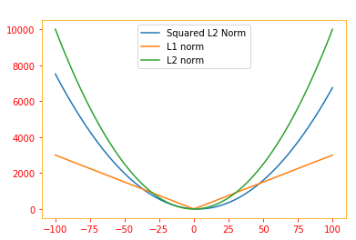

One other norm that commonly arises in machine learning is the <MathBlock formula={String.raw`L^{\infty}`} /> norm, also known as the __max norm__. This norm simplifies to the absolute value of the element with the largest magnitude in the vector,

<MathBlock formula={String.raw`\parallel x \\parallel_{\infty} = max_i |x_i| \tag{15}`} />

If we wish to measure the size of a matrix, in context of deep learning, the most common way to do this is with the __Frobenius norm__:

<MathBlock formula={String.raw`\parallel A \parallel_F = \sqrt{\displaystyle\sum_{i, j} A^2_{i, j}} \tag{16}`} />

which is analogous to the <MathInline formula={String.raw`L^{2}`} /> norm of a vector.

Meaning for example for a matrix:
<MathBlock formula={String.raw`A =
\begin{pmatrix}
2 & -1 & 5 \\
0 & 2 & 1 \\
3  & 1 & 1  \\
\end{pmatrix}`} />

<MathInline formula={String.raw`\parallel A \parallel = [2^2 + (-1^2) + 5^2 + 0^2 + 2^2 + 1^2 + 3^2 + 1^2 + 1^2]^{1/2}`} />

```python
n_matrix_A = tf.constant([[2, -1, 5], [0, 2, 1], [3, 1, 1]], name="matrix_A", dtype=tf.float32)

# Frobenius norm for matrix calculated by setting ord='fro'
frobenius_norm = tf.norm(n_matrix_A, ord='fro', axis=(0, 1))
print("Frobenius norm: {}".format(frobenius_norm))
```

<ResultToggle>
```python
Frobenius norm: 6.78233003616333
```
</ResultToggle>

The dot product of two vectors can be rewritten in terms of norms as:

<MathBlock formula={String.raw`x^{\top} y = ||x||_2 ||y||_2 cos\theta \tag{17}`} />

where <MathInline formula={String.raw`\theta`} /> is the angle between <MathInline formula={String.raw`x`} /> and <MathInline formula={String.raw`y`} />.

```python
# for x(0, 2) and y(2, 2) cos theta = 45 degrees
n_vector_x = tf.constant([[0], [2]], dtype=tf.float32, name="vectorX")
n_vector_y = tf.constant([[2], [2]], dtype=tf.float32, name="vectorY")

# Due to pi being in, we won't get an exact value so we are rounding our final value
prod_RHS = tf.round(tf.multiply(tf.multiply(tf.norm(n_vector_x), tf.norm(n_vector_y)), tf.cos(np.pi/4)))
prod_LHS = tf.tensordot(tf.transpose(n_vector_x), n_vector_y, axes=1, name="LHS")

predictor = tf.equal(prod_RHS, prod_LHS)
def true_print(): print("""Dot Product can be rewritten in terms of norms, where \n
RHS: {} \nLHS: {}""".format(prod_RHS, prod_LHS))

def false_print(): print("""Dot Product can not be rewritten in terms of norms, where \n
RHS: {} \nLHS: {}""".format(prod_RHS, prod_LHS))

tf.cond(predictor, true_print, false_print)

origin=[0,0]
plt.rc_context({'axes.edgecolor':'orange', 'xtick.color':'red', 'ytick.color':'red'})
plt.xlim(-2, 10)
plt.ylim(-1, 10)
plt.axvline(x=0, color='grey', zorder=0)
plt.axhline(y=0, color='grey', zorder=0)
plt.text(-1, 2, r'$\vec{x}$', size=18)
plt.text(2, 1.5, r'$\vec{y}$', size=18)
plt.quiver(*origin, n_vector_x, n_vector_y, color=['#FF9A13','#1190FF'], scale=8)
plt.show()
```

<ResultToggle>
```python
Dot Product can be rewritten in terms of norms, where
RHS: 4.0
LHS: [[4.]]
```
</ResultToggle>

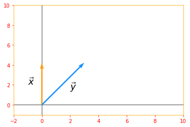

### 02.06 - Special Kinds of Matrices and Vectors

__Diagonal__ matrices consist mostly of zeros and have nonzero entries only along the main diagonal. Identity matrix is an example of diagonal matrix. We write <MathInline formula={String.raw`diag(v)`} /> to denote a square diagonal matrix whose diagonal entries are given by the entries of the vector *v*.

To compute <MathInline formula={String.raw`diag(v)x`} /> we only need to scale each element <MathInline formula={String.raw`x_i`} /> by <MathInline formula={String.raw`v_i`} />. In other words:

<MathBlock formula={String.raw`diag(v)x = v \odot x \tag{18}`} />

```python
# create vector v and x
sp_vector_v = tf.random.uniform([5], minval=0, maxval=10, dtype = tf.int32, seed = 0, name="vector_v")
sp_vector_x = tf.random.uniform([5], minval=0, maxval=10, dtype = tf.int32, seed = 0, name="vector_x")
print("Vector v: {} \nVector x: {}\n".format(sp_vector_v, sp_vector_x))

# RHS diagonal vector v dot diagonal vector x. The linalg.diag converts a vector to a diagonal matrix
sp_RHS = tf.tensordot(tf.linalg.diag(sp_vector_v), tf.linalg.diag(sp_vector_x), axes=1)

# LHS diag(v)x
sp_LHS = tf.multiply(tf.linalg.diag(sp_vector_v), sp_vector_x)

predictor = tf.reduce_all(tf.equal(sp_RHS, sp_LHS))
def true_print(): print("Diagonal of v times x: \n{} \n\nis equal to vector v dot vector x: \n{}".format(sp_RHS, sp_LHS))
def false_print(): print("Diagonal of v times x: \n{} \n\nis NOT equal to vector v dot vector x: \n{}".format(sp_RHS, sp_LHS))

tf.cond(predictor, true_print, false_print)
```

<ResultToggle>
```python
Vector v: [1 3 8 5 3]
Vector x: [9 0 4 1 4]

Diagonal of v times x:
[[ 9  0  0  0  0]
 [ 0  0  0  0  0]
 [ 0  0 32  0  0]
 [ 0  0  0  5  0]
 [ 0  0  0  0 12]]

is equal to vector v dot vector x:
[[ 9  0  0  0  0]
 [ 0  0  0  0  0]
 [ 0  0 32  0  0]
 [ 0  0  0  5  0]
 [ 0  0  0  0 12]]
```
</ResultToggle>

Inverting a square diagonal matrix is also efficient. The inverse exists only if every diagonal entry is nonzero, and in that case:

<MathBlock formula={String.raw`diag(v)^{-1} = diag([1/v_1, \cdots , 1/v_n]^{\top}) \tag{19}`} />

```python
try:
    # try creating a vector_v with zero elements and see what happens
    d_vector_v = tf.random.uniform([5], minval=1, maxval=10, dtype = tf.float32, seed = 0, name="vector_v")
    print("Vector v: {}".format(d_vector_v))

    # linalg.diag converts a vector to a diagonal matrix
    diag_RHS = tf.linalg.diag(tf.transpose(1. / d_vector_v))

    # we convert the vector to diagonal matrix and take it's inverse
    inv_LHS = tf.linalg.inv(tf.linalg.diag(d_vector_v))

    predictor = tf.reduce_all(tf.equal(diag_RHS, inv_LHS))
    def true_print(): print("The inverse of LHS: \n{} \n\nMatch the inverse of RHS: \n{}".format(diag_RHS, inv_LHS))
    def false_print(): print("The inverse of LHS: \n{} \n\n Does not match the inverse of RHS: \n{}".format(diag_RHS, inv_LHS))
    tf.cond(predictor, true_print, false_print)

except:
    print("The inverse exists only if every diagonal is nonzero, your vector looks: \n{}".format(d_vector_v))
```

<ResultToggle>
```python
Vector v: [1.9077636 9.731502  8.638878  1.4345318 1.4367076]
The inverse of LHS:
[[0.524174   0.         0.         0.         0.        ]
 [0.         0.10275906 0.         0.         0.        ]
 [0.         0.         0.11575577 0.         0.        ]
 [0.         0.         0.         0.6970915  0.        ]
 [0.         0.         0.         0.         0.69603586]]

Match the inverse of RHS:
[[0.524174   0.         0.         0.         0.        ]
 [0.         0.10275906 0.         0.         0.        ]
 [0.         0.         0.11575577 0.         0.        ]
 [0.         0.         0.         0.6970915  0.        ]
 [0.         0.         0.         0.         0.69603586]]
```
</ResultToggle>

Not all diagonal matrices need be square. It is possible to construct a rectangular diagonal matrix. Nonsquare diagonal matrices do not have inverses, but we can still multiply by them cheaply. For a nonsquare diagonal matrix <MathInline formula={String.raw`D`} />, the product <MathInline formula={String.raw`Dx`} /> will involve scaling each element of <MathInline formula={String.raw`x`} /> and either concatenating some zeros to the result, if <MathInline formula={String.raw`D`} /> is taller than it is wide, or discarding some of the last elements of the vector, if <MathInline formula={String.raw`D`} /> is wider than it is tall.

A __symmetric__ matrix is any matrix that is equal to its own transpose: <MathBlock formula={String.raw`A = A^{\top}`} />

Symmetric matrices often arise when the entries are generated by some function of two arguments that does not depend on the order of the arguments. For example, if <MathInline formula={String.raw`A`} /> is a matrix of distance measurements, with <MathInline formula={String.raw`A_{i,j}`} /> giving the distance from point *i* to point *j*, then <MathInline formula={String.raw`A_{i, j} = A_{j, i}`} /> because distance functions are symmetric.

```python
# create a symmetric matrix
sp_matrix_A = tf.constant([[0, 1, 3], [1, 2, 4], [3, 4, 5]], name="matrix_a", dtype=tf.int32)

# get the transpose of matrix A
sp_transpose_a = tf.transpose(sp_matrix_A)

predictor = tf.reduce_all(tf.equal(sp_matrix_A, sp_transpose_a))
def true_print(): print("Matrix A: \n{} \n\nMatches the the transpose of Matrix A: \n{}".format(sp_matrix_A, sp_transpose_a))
def false_print(): print("Matrix A: \n{} \n\nDoes Not match the the transpose of Matrix A: \n{}".format(sp_matrix_A, sp_transpose_a))

tf.cond(predictor, true_print, false_print)
```

<ResultToggle>
```python
Matrix A:
[[0 1 3]
 [1 2 4]
 [3 4 5]]

Matches the the transpose of Matrix A:
[[0 1 3]
 [1 2 4]
 [3 4 5]]
```
</ResultToggle>

A vector <MathInline formula={String.raw`x`} /> and a vector <MathInline formula={String.raw`y`} /> are __*orthogonal*__ to each other if <MathBlock formula={String.raw`x^{\top} y = 0`} />. If both vectors have nonzero norm, this means that they are at a 90 degree angle to each other.

```python
# Lets create two vectors
ortho_vector_x = tf.constant([2, 2], dtype=tf.float32, name="vector_x")
ortho_vector_y = tf.constant([2, -2], dtype=tf.float32, name="vector_y")
print("Vector x: {} \nVector y: {}\n".format(ortho_vector_x, ortho_vector_y))

# lets verify if x transpose dot y is zero
ortho_LHS = tf.tensordot(tf.transpose(ortho_vector_x), ortho_vector_y, axes=1)
print("X transpose times y = {}\n".format(ortho_LHS))

# let's see what their norms are
ortho_norm_x = tf.norm(ortho_vector_x)
ortho_norm_y = tf.norm(ortho_vector_y)
print("Norm x: {} \nNorm y: {}\n".format(ortho_norm_x, ortho_norm_y))

# If they have non zero norm, let's see what angle they are to each other
if tf.logical_and(ortho_norm_x > 0, ortho_norm_y > 0):
    # from the equation cos theta = (x dot y)/(norm of x times norm y)
    cosine_angle = (tf.divide(tf.tensordot(ortho_vector_x, ortho_vector_y, axes=1), tf.multiply(ortho_norm_x, ortho_norm_y)))
    print("Angle between vector x and vector y is: {} degrees".format(tf.acos(cosine_angle) * 180 /np.pi))

    origin=[0,0]
    plt.rc_context({'axes.edgecolor':'orange', 'xtick.color':'red', 'ytick.color':'red'})
    plt.xlim(-1, 10)
    plt.ylim(-10, 10)
    plt.axvline(x=0, color='grey', zorder=0)
    plt.axhline(y=0, color='grey', zorder=0)
    plt.text(1, 4, r'$\vec{x}$', size=18)
    plt.text(1, -6, r'$\vec{y}$', size=18)
    plt.quiver(*origin, ortho_vector_x, ortho_vector_y, color=['#FF9A13','#1190FF'], scale=8)
    plt.show()
```

<ResultToggle>
```python
Vector x: [2. 2.]
Vector y: [ 2. -2.]

X transpose times y = 0.0

Norm x: 2.8284270763397217
Norm y: 2.8284270763397217

Angle between vector x and vector y is: 90.0 degrees
```
</ResultToggle>

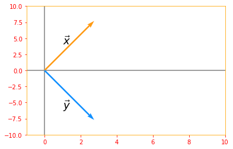

A __unit vector__ is a vector with a __unit norm__: <MathInline formula={String.raw`\parallel x \parallel_2 = 1`} />.

If two vectors are not only are orthogonal but also have unit norm, we call them __orthonormal__.

A __orthogonal matrix__ is a square matrix whose rows are mutually orthonormal and whose columns are mutually orthonormal:

<MathBlock formula={String.raw`A^{\top} A = AA^{\top} = I \tag{20}`} />

which implies <MathBlock formula={String.raw`A^{-1} = A^{\top}`} />

so orthogonal matrices are of interest because their inverse is very cheap to compute.

```python
# Lets use sine and cosine to create orthogonal matrix
ortho_matrix_A = tf.Variable([[tf.cos(.5), -tf.sin(.5)], [tf.sin(.5), tf.cos(.5)]], name="matrixA")
print("Matrix A: \n{}\n".format(ortho_matrix_A))

# extract columns from the matrix to verify if they are orthogonal
col_0 = tf.reshape(ortho_matrix_A[:, 0], [2, 1])
col_1 = tf.reshape(ortho_matrix_A[:, 1], [2, 1])
row_0 = tf.reshape(ortho_matrix_A[0, :], [2, 1])
row_1 = tf.reshape(ortho_matrix_A[1, :], [2, 1])

# Verifying if the columns are orthogonal
ortho_column = tf.tensordot(tf.transpose(col_0), col_1, axes=2)
print("Columns are orthogonal: {}".format(ortho_column))
plt.rc_context({'axes.edgecolor':'orange', 'xtick.color':'red', 'ytick.color':'red'})
origin = [0, 0]
plt.xlim(-2, 2)
plt.ylim(-3, 4)
plt.axvline(x=0, color='grey', zorder=0)
plt.axhline(y=0, color='grey', zorder=0)
plt.text(0, 2, r'$\vec{col_0}$', size=18)
plt.text(0.5, -2, r'$\vec{col_1}$', size=18)
plt.quiver(*origin, col_0, col_1, color=['#FF9A13','#FF9A13'], scale=3)

# Verifying if the rows are orthogonal
ortho_row = tf.tensordot(tf.transpose(row_0), row_1, axes=2)
print("Rows are orthogonal: {}\n".format(ortho_row))
plt.text(-1, 2, r'$\vec{row_0}$', size=18)
plt.text(1, 0.5, r'$\vec{row_1}$', size=18)
plt.quiver(*origin, row_0, row_1, color=['r','r'], scale=3)
plt.show()

# inverse of matrix A
ortho_inverse_A = tf.linalg.inv(ortho_matrix_A)

# Transpose of matrix A
ortho_transpose_A = tf.transpose(ortho_matrix_A)

predictor = tf.reduce_all(tf.equal(ortho_inverse_A, ortho_transpose_A))
def true_print(): print("Inverse of Matrix A: \n{} \n\nEquals the transpose of Matrix A: \n{}".format(ortho_inverse_A, ortho_transpose_A))
def false_print(): print("Inverse of Matrix A: \n{} \n\nDoes not equal the transpose of Matrix A: \n{}".format(ortho_inverse_A, ortho_transpose_A))

tf.cond(predictor, true_print, false_print)
```

<ResultToggle>
```python
Matrix A:
<tf.Variable 'matrixA:0' shape=(2, 2) dtype=float32, numpy=
array([[ 0.87758255, -0.47942555],
       [ 0.47942555,  0.87758255]], dtype=float32)>

Columns are orthogonal: 0.0
Rows are orthogonal: 0.0
```
</ResultToggle>

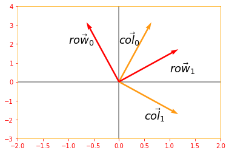

<ResultToggle>
```python
Inverse of Matrix A:
[[ 0.87758255  0.47942555]
 [-0.47942555  0.87758255]]

Equals the transpose of Matrix A:
[[ 0.87758255  0.47942555]
 [-0.47942555  0.87758255]]
```
</ResultToggle>

### 02.07 - Eigendecomposition

We can represent a number, for example 12 as 12 = 2 x 2 x 3. The representation will change depending on whether we write it in base ten or in binary but the above representation will always be true and from that we can conclude that 12 is not divisible by 5 and that any integer multiple of 12 will be divisible by 3.

Similarly, we can also decompose matrices in ways that show us information about their functional properties that is not obvious from the representation of the matrix as an array of elements. One of the most widely used kinds of matrix decomposition is called __eigendecomposition__, in which we decompose a matrix into a set of eigenvectors and eigenvalues.

An __eigenvector__ of a square matrix <MathInline formula={String.raw`A`} /> is a nonzero vector <MathInline formula={String.raw`v`} /> such that multiplication by <MathInline formula={String.raw`A`} /> alters only the scale of <MathInline formula={String.raw`v`} />, in short this is a special vector that doesn't change the direction of the matrix when applied to it :

<MathBlock formula={String.raw`Av = \lambda v \tag{21}`} />

The scale <MathInline formula={String.raw`\lambda`} /> is known as the __eigenvalue__ corresponding to this eigenvector.

```python
# Let's see how we can compute the eigen vectors and values from a matrix
e_matrix_A = tf.random.uniform([2, 2], minval=3, maxval=10, dtype=tf.float32, name="matrixA")
print("Matrix A: \n{}\n\n".format(e_matrix_A))

# Calculating the eigen values and vectors using tf.linalg.eigh, if you only want the values you can use eigvalsh
eigen_values_A, eigen_vectors_A = tf.linalg.eigh(e_matrix_A)
print("Eigen Vectors: \n{} \n\nEigen Values: \n{}\n".format(eigen_vectors_A, eigen_values_A))

# Now lets plot our Matrix with the Eigen vector and see how it looks
Av = tf.tensordot(e_matrix_A, eigen_vectors_A, axes=0)
vector_plot([tf.reshape(Av, [-1]), tf.reshape(eigen_vectors_A, [-1])], 10, 10)
```

<ResultToggle>
```python
Matrix A:
[[5.450138 9.455662]
 [9.980919 9.223391]]

Eigen Vectors:
[[-0.76997876 -0.6380696 ]
 [ 0.6380696  -0.76997876]]

Eigen Values:
[-2.8208985 17.494429 ]
```
</ResultToggle>

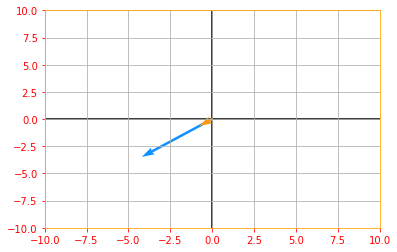

If <MathInline formula={String.raw`v`} /> is an eigenvector of <MathInline formula={String.raw`A`} />, then so is any rescaled vector <MathInline formula={String.raw`sv`} /> for <MathInline formula={String.raw`s \in \mathbb{R}, s \neq 0`} />.

```python
# Lets us multiply our eigen vector by a random value s and plot the above graph again to see the rescaling
sv = tf.multiply(5, eigen_vectors_A)
vector_plot([tf.reshape(Av, [-1]), tf.reshape(sv, [-1])], 10, 10)
```

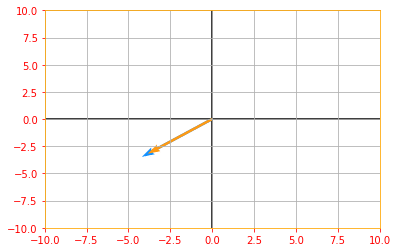

Suppose that a matrix <MathInline formula={String.raw`A`} /> has <MathInline formula={String.raw`n`} /> linearly independent eigenvectors <MathInline formula={String.raw`\{v^{(1)}, \cdots, v^{(n)}\}`} /> with corresponding eigenvalues <MathInline formula={String.raw`\{\lambda_{(1)}, \cdots, \lambda_{(n)}\}`} />. We may concatenate all the eigenvectors to form a matrix <MathInline formula={String.raw`V`} /> with one eigenvector per column: <MathInline formula={String.raw`V = [v^{(1)}, \cdots, v^{(n)}]`} />. Likewise, we can concatenate the eigenvalues to form a vector <MathBlock formula={String.raw`\lambda = [\lambda_{(1)}, \cdots, \lambda_{(n)}]^{\top}`} />. The __eigendecomposition__ of <MathInline formula={String.raw`A`} /> is then given by

<MathBlock formula={String.raw`A = V diag(\lambda)V^{-1} \tag{22}`} />

```python
# Creating a matrix A to find it's decomposition
eig_matrix_A = tf.constant([[5, 1], [3, 3]], dtype=tf.float32)
new_eigen_values_A, new_eigen_vectors_A = tf.linalg.eigh(eig_matrix_A)

print("Eigen Values of Matrix A: {} \n\nEigen Vector of Matrix A: \n{}\n".format(new_eigen_values_A, new_eigen_vectors_A))

# calculate the diag(lamda)
diag_lambda = tf.linalg.diag(new_eigen_values_A)
print("Diagonal of Lambda: \n{}\n".format(diag_lambda))

# Find the eigendecomposition of matrix A
decomp_A = tf.tensordot(tf.tensordot(eigen_vectors_A, diag_lambda, axes=1), tf.linalg.inv(new_eigen_vectors_A), axes=1)

print("The decomposition Matrix A: \n{}".format(decomp_A))
```

<ResultToggle>
```python
Eigen Values of Matrix A: [0.8377223 7.1622777]

Eigen Vector of Matrix A:
[[-0.5847103   0.81124216]
 [ 0.81124216  0.5847103 ]]

Diagonal of Lambda:
[[0.8377223 0.       ]
 [0.        7.1622777]]

The decomposition Matrix A:
[[-3.3302479 -3.195419 ]
 [-4.786382  -2.7909322]]
```
</ResultToggle>

Not every matrix can be decomposed into eigenvalues and eigenvectors. In some cases, the decomposition exists but involves complex rather than real numbers.

In this book, we usually need to decompose only a specific class of matrices that have a simple decomposition. Specifically, every real symmetric matrix can be decomposed into an expression using only real-valued eigenvectors and eigenvalues:

<MathBlock formula={String.raw`A = Q \Lambda Q^{\top} \tag{23}`} />

where <MathInline formula={String.raw`Q`} /> is an orthogonal matrix composed of eigenvectors of <MathInline formula={String.raw`A`} /> and <MathInline formula={String.raw`\Lambda`} /> is a diagonal matrix. The eigenvalue <MathInline formula={String.raw`\Lambda_{i,i}`} /> is associated with the eigenvector in column *i* of <MathInline formula={String.raw`Q`} />, denoted as <MathBlock formula={String.raw`Q_{:, i}`} />. Because <MathInline formula={String.raw`Q`} /> is an orthogonal matrix, we can think of <MathInline formula={String.raw`A`} /> as scaling space by <MathInline formula={String.raw`\Lambda_i`} /> in direction <MathInline formula={String.raw`v^{(i)}`} />.

```python
# In section 2.6 we manually created a matrix to verify if it is symmetric, but what if we don't know the exact values and want to create a random symmetric matrix
new_matrix_A = tf.Variable(tf.random.uniform([2,2], minval=1, maxval=10, dtype=tf.float32))

# to create an upper triangular matrix from a square one
X_upper = tf.linalg.band_part(new_matrix_A, 0, -1)
sym_matrix_A = tf.multiply(0.5, (X_upper + tf.transpose(X_upper)))
print("Symmetric Matrix A: \n{}\n".format(sym_matrix_A))

# create orthogonal matrix Q from eigen vectors of A
eigen_values_Q, eigen_vectors_Q = tf.linalg.eigh(sym_matrix_A)
print("Matrix Q: \n{}\n".format(eigen_vectors_Q))

# putting eigen values in a diagonal matrix
new_diag_lambda = tf.linalg.diag(eigen_values_Q)
print("Matrix Lambda: \n{}\n".format(new_diag_lambda))

sym_RHS = tf.tensordot(tf.tensordot(eigen_vectors_Q, new_diag_lambda, axes=1), tf.transpose(eigen_vectors_Q), axes=1)

predictor = tf.reduce_all(tf.equal(tf.round(sym_RHS), tf.round(sym_matrix_A)))
def true_print(): print("It WORKS. \nRHS: \n{} \n\nLHS: \n{}".format(sym_RHS, sym_matrix_A))
def false_print(): print("Condition FAILED. \nRHS: \n{} \n\nLHS: \n{}".format(sym_RHS, sym_matrix_A))

tf.cond(predictor, true_print, false_print)
```

<ResultToggle>
```python
Symmetric Matrix A:
[[4.517448  3.3404353]
 [3.3404353 7.411926 ]]

Matrix Q:
[[-0.8359252 -0.5488433]
 [ 0.5488433 -0.8359252]]

Matrix Lambda:
[[2.3242188 0.       ]
 [0.        9.605155 ]]

It WORKS.
RHS:
[[4.5174475 3.340435 ]
 [3.340435  7.4119253]]

LHS:
[[4.517448  3.3404353]
 [3.3404353 7.411926 ]]
```
</ResultToggle>

The eigendecomposition of a matrix tells us many useful facts about the matrix. The matrix is singular if and only if any of the eigenvalues are zero. The eigendecomposition of a real symmetric matrix can also be used to optimize quadratic expressions of the form <MathBlock formula={String.raw`f(x) = x^{\top} Ax`} /> subject to <MathInline formula={String.raw`\parallel x \parallel_2 = 1`} />.

The above equation can be solved as following, we know that if <MathInline formula={String.raw`x`} /> is an Eigenvector of <MathInline formula={String.raw`A`} /> and <MathInline formula={String.raw`\lambda`} /> is the corresponding eigenvalue, then <MathInline formula={String.raw`Ax = \lambda x`} />, therefore <MathBlock formula={String.raw`f(x) = x^{\top} Ax = x^{\top} \lambda x = x^{\top} x \lambda`} /> and since <MathInline formula={String.raw`\parallel x \parallel_2 = 1`} /> and <MathBlock formula={String.raw`x^{\top} x =1`} />, the above equation boils down to <MathInline formula={String.raw`f(x) = \lambda`} />

Whenever <MathInline formula={String.raw`x`} /> is equal to an eigenvector of <MathInline formula={String.raw`A, \ f`} /> takes on the value of the corresponding eigenvalue and its minimum value within the constraint region is the minimum eigenvalue.

A matrix whose eigenvalues are all positive is called __positive definite__. A matrix whose eigenvalues are all positive or zero valued is called __positive semidefinite__. Likewise, if all eigenvalues are negative, the matrix is __negative definite__, and if all eigenvalues are negative or zero valued, it is __negative semidefinite__. Positive semidefinite matrices are interesting because they guarantee that <MathBlock formula={String.raw`\forall x, x^{\top} Ax \geq 0`} />. Positive definite matrices additionally guarantee that <MathInline formula={String.raw`x^T Ax = 0 \implies x=0`} />.

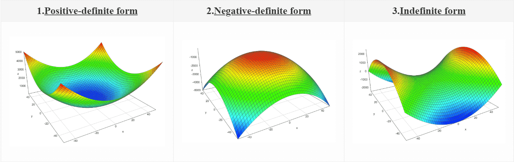

### 02.08 - Singular Value Decomposition

The __singular value decomposition (SVD)__ provides another way to factorize a matrix into  __singular vectors__ and __singular values__. The SVD enables us to discover some of the same kind of information as the eigendecomposition reveals, however, the SVD is more generally applicable. Every real matrix has a singular value decomposition, but the same is not true of the eigenvalue decomposition. SVD can be written as:

<MathBlock formula={String.raw`A = UDV^{\top} \tag{24}`} />

Suppose <MathInline formula={String.raw`A`} /> is an *m x n* matrix, then <MathInline formula={String.raw`U`} /> is defined to be an *m x m* rotation matrix, <MathInline formula={String.raw`D`} /> to be an *m x n* matrix scaling & projecting matrix, and <MathInline formula={String.raw`V`} /> to be an *n x n* rotation matrix.

Each of these matrices is defined to have a special structure. The matrices <MathInline formula={String.raw`U`} /> and <MathInline formula={String.raw`V`} /> are both defined to be orthogonal matrices <MathBlock formula={String.raw`(U^{\top} = U^{-1} \ \text{and} \ V^{\top} = V^{-1})`} />. The matrix <MathInline formula={String.raw`D`} /> is defined to be a diagonal matrix.

The elements along the diagonal of <MathInline formula={String.raw`D`} /> are known as the __singular values__ of the matrix <MathInline formula={String.raw`A`} />. The columns of <MathInline formula={String.raw`U`} /> are known as the __left-singular vectors__. The columns of <MathInline formula={String.raw`V`} /> are known as as the __right-singular vectors__.

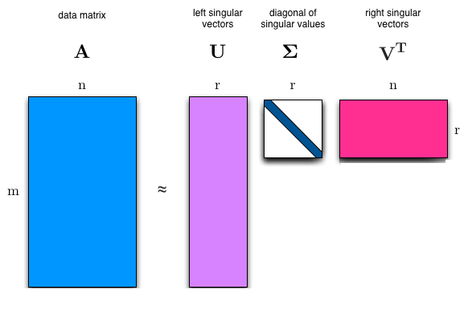

```python
# mxn matrix A
svd_matrix_A = tf.constant([[2, 3], [4, 5], [6, 7]], dtype=tf.float32)
print("Matrix A: \n{}\n".format(svd_matrix_A))

# Using tf.linalg.svd to calculate the singular value decomposition where d: Matrix D, u: Matrix U and v: Matrix V
d, u, v = tf.linalg.svd(svd_matrix_A, full_matrices=True, compute_uv=True)
print("Diagonal D: \n{} \n\nMatrix U: \n{} \n\nMatrix V^T: \n{}".format(d, u, v))
```

<ResultToggle>
```python
Matrix A:
[[2. 3.]
 [4. 5.]
 [6. 7.]]

Diagonal D:
[11.782492    0.41578525]

Matrix U:
[[ 0.30449855 -0.86058956  0.40824753]
 [ 0.54340035 -0.19506174 -0.81649673]
 [ 0.78230214  0.47046405  0.40824872]]

Matrix V^T:
[[ 0.63453555  0.7728936 ]
 [ 0.7728936  -0.63453555]]
```
</ResultToggle>

```python
# Lets see if we can bring back the original matrix from the values we have

# mxm orthogonal matrix U
svd_matrix_U = tf.constant([[0.30449855, -0.86058956, 0.40824753], [0.54340035, -0.19506174, -0.81649673], [0.78230214, 0.47046405, 0.40824872]])
print("Orthogonal Matrix U: \n{}\n".format(svd_matrix_U))

# mxn diagonal matrix D
svd_matrix_D = tf.constant([[11.782492, 0], [0, 0.41578525], [0, 0]], dtype=tf.float32)
print("Diagonal Matrix D: \n{}\n".format(svd_matrix_D))

# nxn transpose of matrix V
svd_matrix_V_trans = tf.constant([[0.63453555, 0.7728936], [0.7728936, -0.63453555]], dtype=tf.float32)
print("Transpose Matrix V: \n{}\n".format(svd_matrix_V_trans))

# UDV(^T)
svd_RHS = tf.tensordot(tf.tensordot(svd_matrix_U, svd_matrix_D, axes=1), svd_matrix_V_trans, axes=1)

predictor = tf.reduce_all(tf.equal(tf.round(svd_RHS), svd_matrix_A))
def true_print(): print("It WORKS. \nRHS: \n{} \n\nLHS: \n{}".format(tf.round(svd_RHS), svd_matrix_A))
def false_print(): print("Condition FAILED. \nRHS: \n{} \n\nLHS: \n{}".format(tf.round(svd_RHS), svd_matrix_A))

tf.cond(predictor, true_print, false_print)
```

<ResultToggle>
```python
Orthogonal Matrix U:
[[ 0.30449855 -0.86058956  0.40824753]
 [ 0.54340035 -0.19506174 -0.81649673]
 [ 0.78230214  0.47046405  0.40824872]]

Diagonal Matrix D:
[[11.782492    0.        ]
 [ 0.          0.41578525]
 [ 0.          0.        ]]

Transpose Matrix V:
[[ 0.63453555  0.7728936 ]
 [ 0.7728936  -0.63453555]]

It WORKS.
RHS:
[[2. 3.]
 [4. 5.]
 [6. 7.]]

LHS:
[[2. 3.]
 [4. 5.]
 [6. 7.]]
```
</ResultToggle>

Matrix <MathInline formula={String.raw`A`} /> can be seen as a linear transformation. This transformation can be decomposed into three sub-transformations:

1. Rotation,
2. Re-scaling and projecting,
3. Rotation.

These three steps correspond to the three matrices <MathInline formula={String.raw`U, D \ \text{and} \ V`} />

Let's see how these transformations are taking place in order

```python
# Let's define a unit square
svd_square = tf.constant([[0, 0, 1, 1],[0, 1, 1, 0]], dtype=tf.float32)

# a new 2x2 matrix
svd_new_matrix = tf.constant([[1, 1.5], [0, 1]])

# SVD for the new matrix
new_d, new_u, new_v = tf.linalg.svd(svd_new_matrix, full_matrices=True, compute_uv=True)

# lets' change d into a diagonal matrix
new_d_marix = tf.linalg.diag(new_d)

# Rotation: V^T for a unit square
plot_transform(svd_square, tf.tensordot(new_v, svd_square, axes=1), "$Square$", "$V^T \cdot Square$", "Rotation", axis=[-0.5, 3.5 , -1.5, 1.5])
plt.show()

# Scaling and Projecting: DV^(T)
plot_transform(tf.tensordot(new_v, svd_square, axes=1), tf.tensordot(new_d_marix, tf.tensordot(new_v, svd_square, axes=1), axes=1), "$V^T \cdot Square$", "$D \cdot V^T \cdot Square$", "Scaling and Projecting", axis=[-0.5, 3.5 , -1.5, 1.5])
plt.show()

# Second Rotation: UDV^(T)
trans_1 = tf.tensordot(tf.tensordot(new_d_marix, new_v, axes=1), svd_square, axes=1)
trans_2 = tf.tensordot(tf.tensordot(tf.tensordot(new_u, new_d_marix, axes=1), new_v, axes=1), svd_square, axes=1)
plot_transform(trans_1, trans_2,"$U \cdot D \cdot V^T \cdot Square$", "$D \cdot V^T \cdot Square$", "Second Rotation", color=['#1190FF', '#FF9A13'], axis=[-0.5, 3.5 , -1.5, 1.5])
plt.show()
```

<ResultToggle>
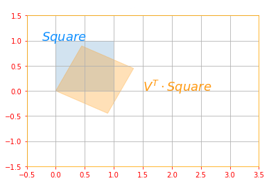

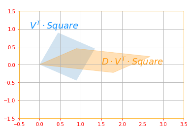

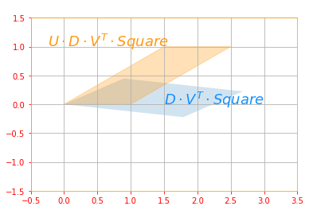
</ResultToggle>

The above sub transformations can be found for each matrix as follows:

- <MathInline formula={String.raw`U`} /> corresponds to the eigenvectors of <MathBlock formula={String.raw`A A^{\top}`} />
- <MathInline formula={String.raw`V`} /> corresponds to the eigenvectors of <MathBlock formula={String.raw`A^{\top} A`} />
- <MathInline formula={String.raw`D`} /> corresponds to the eigenvalues <MathBlock formula={String.raw`A A^{\top}`} />  or <MathBlock formula={String.raw`A^{\top} A`} /> which are the same.

As an exercise try proving this is the case.

Perhaps the most useful feature of the SVD is that we can use it to partially generalize matrix inversion to nonsquare matrices, as we will see in the next section.

### 02.09 - The Moore-Penrose Pseudoinverse

Matrix inversion is not defined for matrices that are not square. Suppose we want to make a left-inverse <MathInline formula={String.raw`B`} /> of a matrix <MathInline formula={String.raw`A`} /> so that we can solve a linear equation <MathInline formula={String.raw`Ax = Y`} /> by left multiplying each side to obtain <MathInline formula={String.raw`x = By`} />.

Depending on the structure of the problem, it may not be possible to design a unique mapping from <MathInline formula={String.raw`A`} /> to <MathInline formula={String.raw`B`} />.

The __Moore-Penrose pseudoinverse__ enables use to make some headway in these cases. The pseudoinverse of <MathInline formula={String.raw`A`} /> is defined as a matrix:

<MathBlock formula={String.raw`A^+ = lim_{\alpha \rightarrow 0} (A^{\top} A + \alpha I)^{-1} A^{\top} \tag{25}`} />

Practical algorithms for computing the pseudoinverse are based not on this definition, but rather on the formula:

<MathBlock formula={String.raw`A^+ = VD^+U^{\top} \tag{26}`} />

where <MathInline formula={String.raw`U, D`} /> and <MathInline formula={String.raw`V`} /> are the singular decomposition of <MathInline formula={String.raw`A`} /> and the pseudoinverse of <MathInline formula={String.raw`D^+`} /> of a diagonal matrix <MathInline formula={String.raw`D`} /> is obtained by taking the reciprocal of its nonzero elements then taking the transpose of the resulting matrix.

```python
# Matrix A
mpp_matrix_A = tf.random.uniform([3, 2], minval=1, maxval=10, dtype=tf.float32)
print("Matrix A: \n{}\n".format(mpp_matrix_A))

# Singular Value decomposition of matrix A
mpp_d, mpp_u, mpp_v = tf.linalg.svd(mpp_matrix_A, full_matrices=True, compute_uv=True)
print("Matrix U: \n{} \n\nMatrix V: \n{}\n".format(mpp_u, mpp_v))

# pseudo inverse of matrix D
d_plus = tf.concat([tf.transpose(tf.linalg.diag(tf.math.reciprocal(mpp_d))), tf.zeros([2, 1])], axis=1)
print("D plus: \n{}\n".format(d_plus))

# moore-penrose pseudoinverse of matrix A
matrix_A_star = tf.matmul(tf.matmul(mpp_v, d_plus, transpose_a=True), mpp_u, transpose_b=True)

print("The Moore-Penrose pseudoinverse of Matrix A: \n{}".format(matrix_A_star))
```

<ResultToggle>
```python
Matrix A:
[[6.1130576 2.7441363]
 [8.039717  5.8797803]
 [9.662358  8.468619 ]]

Matrix U:
[[ 0.3731766  -0.8532468   0.36429217]
 [ 0.56925267 -0.09947323 -0.8161228 ]
 [ 0.7325915   0.51193243  0.44859198]]

Matrix V:
[[ 0.79661715 -0.60448414]
 [ 0.60448414  0.79661715]]

D plus:
[[0.05716072 0.         0.        ]
 [0.         0.5653558  0.        ]]

The Moore-Penrose pseudoinverse of Matrix A:
[[-0.27460322 -0.0080738   0.2083109 ]
 [-0.39717284 -0.06446922  0.20524703]]
```
</ResultToggle>

When <MathInline formula={String.raw`A`} /> has more columns than rows, then solving a linear equation using the pseudoinverse provides one of the many possible solutions. Specifically, it provides the solution <MathInline formula={String.raw`x = A^+y`} /> with minimal Euclidean norm <MathInline formula={String.raw`\parallel x \parallel_2`} /> among all possible solutions.

```python
mpp_vector_y = tf.constant([[2], [3], [4]], dtype=tf.float32)
print("Vector y: \n{}\n".format(mpp_vector_y))

mpp_vector_x = tf.matmul(matrix_A_star, mpp_vector_y)
print("Vector x: \n{}".format(mpp_vector_x))
```

<ResultToggle>
```python
Vector y:
[[2.]
 [3.]
 [4.]]

Vector x:
[[ 0.2598158 ]
 [-0.16676521]]
```
</ResultToggle>

When <MathInline formula={String.raw`A`} /> has more rows than columns, it is possible for there to be no solution. In this case, using the pseudoinverse gives us the <MathInline formula={String.raw`x`} /> for which <MathInline formula={String.raw`Ax`} /> is as close as possible to <MathInline formula={String.raw`y`} /> in terms of Euclidean norm <MathInline formula={String.raw`\parallel Ax - y \parallel_2`} />

### 02.10 - The Trace Operator

The trace operator gives the sum of all the diagonal entries of a matrix:

<MathBlock formula={String.raw`Tr(A) = \displaystyle\sum_i A_{i,i} \tag{27}`} />

```python
# random 3x3 matrix A
to_matrix_A = tf.random.uniform([3, 3], minval=0, maxval=10, dtype=tf.float32)

# trace of matrix A using tf.linalg.trace
trace_matrix_A = tf.linalg.trace(to_matrix_A)

print("Trace of Matrix A: \n{} \nis: {}".format(to_matrix_A, trace_matrix_A))
```

<ResultToggle>
```python
Trace of Matrix A:
[[1.0423017 9.2543545 9.264312 ]
 [8.952941  8.2056675 4.0400686]
 [8.285712  6.5746584 8.217355 ]]
is: 17.46532440185547
```
</ResultToggle>

The trace operator is useful for a variety of reasons. Some operations that are difficult to specify without resorting to summation notation can be specified using matrix products and the trace operator. For example, the trace operator provides
an alternative way of writing the Frobenius norm of a matrix:

<MathBlock formula={String.raw`||A||_F = \sqrt{Tr(AA^{\top})} \tag{28}`} />

```python
# Frobenius Norm of A
frobenius_A = tf.norm(to_matrix_A)

# sqrt(Tr(A times A^T))
trace_rhs = tf.sqrt(tf.linalg.trace(tf.matmul(to_matrix_A, to_matrix_A, transpose_b=True)))

predictor = tf.equal(tf.round(frobenius_A), tf.round(trace_rhs))
def true_print(): print("It WORKS. \nRHS: {} \nLHS: {}".format(frobenius_A, trace_rhs))
def false_print(): print("Condition FAILED. \nRHS: {} \nLHS: {}".format(frobenius_A, trace_rhs))

tf.cond(predictor, true_print, false_print)
```
<ResultToggle>
```python
It WORKS.
RHS: 22.71059799194336
LHS: 22.710599899291992
```
</ResultToggle>

Writing an expression in terms of the trace operator opens up opportunities to manipulate the expression using many useful identities. For example, the trace operator is invariant to the transpose operator:

<MathBlock formula={String.raw`Tr(A) = Tr(A^{\top}) \tag{29}`} />

```python
# Transpose of Matrix A
trans_matrix_A = tf.transpose(to_matrix_A)

#Trace of the transpose Matrix A
trace_trans_A = tf.linalg.trace(trans_matrix_A)

predictor = tf.equal(trace_matrix_A, trace_trans_A)
def true_print(): print("It WORKS. \nRHS: {} \nLHS: {}".format(trace_matrix_A, trace_trans_A))
def false_print(): print("Condition FAILED. \nRHS: {} \nLHS: {}".format(trace_matrix_A, trace_trans_A))

tf.cond(predictor, true_print, false_print)
```

<ResultToggle>
```python
It WORKS.
RHS: 17.46532440185547
LHS: 17.46532440185547
```
</ResultToggle>

The trace of a square matrix composed of many factors is also invariant to moving the last factor into the first position, if the shapes of the corresponding matrices allow the resulting product to be defined:

<MathBlock formula={String.raw`Tr(ABC) = Tr(CAB) = TR(BCA) \tag{30}`} />

```python
# random 3x3 matrix B and matrix C
to_matrix_B = tf.random.uniform([3, 3], minval=0, maxval=10, dtype=tf.float32)
to_matrix_C = tf.random.uniform([3, 3], minval=0, maxval=10, dtype=tf.float32)

# ABC
abc = tf.tensordot((tf.tensordot(to_matrix_A, to_matrix_B, axes=1)), to_matrix_C, axes=1)

# CAB
cab = tf.tensordot((tf.tensordot(to_matrix_C, to_matrix_A, axes=1)), to_matrix_B, axes=1)

# BCA
bca = tf.tensordot((tf.tensordot(to_matrix_B, to_matrix_C, axes=1)), to_matrix_A, axes=1)

# trace of matrix ABC, CAB and matrix BCA
trace_matrix_abc = tf.linalg.trace(abc)
trace_matrix_cab = tf.linalg.trace(cab)
trace_matrix_bca = tf.linalg.trace(bca)

predictor = tf.equal(tf.round(trace_matrix_abc), tf.round(trace_matrix_cab)) and tf.equal(tf.round(trace_matrix_cab), tf.round(trace_matrix_bca))
def true_print(): print("It WORKS. \nABC: {} \nCAB: {} \nBCA: {}".format(trace_matrix_abc, trace_matrix_cab, trace_matrix_bca))
def false_print(): print("Condition FAILED. \nABC: {} \nCAB: {} \nBCA: {}".format(trace_matrix_abc, trace_matrix_cab, trace_matrix_bca))

tf.cond(predictor, true_print, false_print)
```

<ResultToggle>
```python
It WORKS.
ABC: 5854.24609375
CAB: 5854.24609375
BCA: 5854.24609375
```
</ResultToggle>

This invariance to cyclic permutation holds even if the resulting product has a different shape. For example, for <MathBlock formula={String.raw`A \in \mathbb{R}^{m \times n}`} /> and <MathBlock formula={String.raw`B \in \mathbb{R}^{n \times m}`} />, we have <MathInline formula={String.raw`Tr(AB) = Tr(BA)`} /> even though <MathBlock formula={String.raw`AB \in \mathbb{R}^{m \times m}`} /> and <MathBlock formula={String.raw`BA \in \mathbb{R}^{n \times n}`} />

```python
# mxn matrix A
to_new_matrix_A = tf.random.uniform([3, 2], minval=0, maxval=10, dtype=tf.float32)
print(" 3x2 Matrix A: \n{}\n".format(to_new_matrix_A))

# mxn matrix B
to_new_matrix_B = tf.random.uniform([2, 3], minval=0, maxval=10, dtype=tf.float32)
print(" 3x2 Matrix B: \n{}\n".format(to_new_matrix_B))

# trace of matrix AB and BA
ab = tf.linalg.trace(tf.matmul(to_new_matrix_A, to_new_matrix_B))
ba = tf.linalg.trace(tf.matmul(to_new_matrix_B, to_new_matrix_A))

predictor = tf.equal(tf.round(ab), tf.round(ba))
def true_print(): print("It WORKS. \nAB: {} \nBA: {}".format(ab, ba))
def false_print(): print("Condition FAILED. \nAB: {} \nBA: {}".format(ab, ba))

tf.cond(predictor, true_print, false_print)
```

<ResultToggle>
```python
3x2 Matrix A:
[[1.4351392  2.850753  ]
 [3.6514747  7.5348463 ]
 [4.881668   0.43383718]]

3x2 Matrix B:
[[1.7338943 9.986754  8.326568 ]
 [6.2179327 3.0207145 8.137293 ]]

It WORKS.
AB: 123.61897277832031
BA: 123.61897277832031
```
</ResultToggle>

### 02.11 - The Determinant

The determinant of a square matrix, denoted det(<MathInline formula={String.raw`A`} />), is a function that maps matrices to real scalars. You can calculate the determinant of a  2 x 2 matrix as:

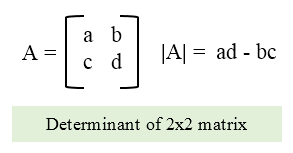

For a 3 x 3 matrix:

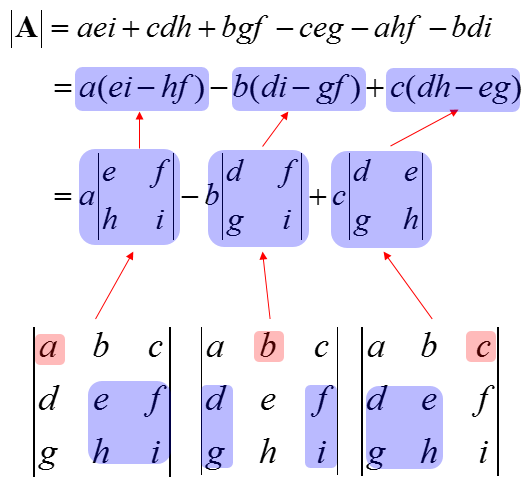

```python
# calculate det of a matrix
det_matrix_A = tf.constant([[3,1], [0,3]], dtype=tf.float32)
det_A = tf.linalg.det(det_matrix_A)
print("Matrix A: \n{} \nDeterminant of Matrix A: \n{}".format(det_matrix_A, det_A))

vector_plot(det_matrix_A, 5, 5)
```

<ResultToggle>
```python
Matrix A:
[[3. 1.]
 [0. 3.]]
Determinant of Matrix A: 9.0
```
</ResultToggle>

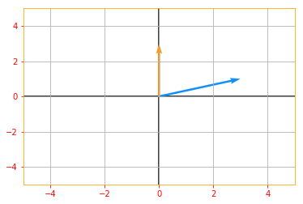

The determinant is equal to the product of all the eigenvalues of the matrix.

```python
# Let's find the eigen values of matrix A
d_eigen_values = tf.linalg.eigvalsh(det_matrix_A)
eigvalsh_product = tf.multiply(d_eigen_values[0], d_eigen_values[1])

# lets validate if the product of the eigen values is equal to the determinant
predictor = tf.equal(eigvalsh_product, det_A)
def true_print(): print("It WORKS. \nRHS: \n{} \n\nLHS: \n{}".format(eigvalsh_product, det_A))
def false_print(): print("Condition FAILED. \nRHS: \n{} \n\nLHS: \n{}".format(eigvalsh_product, det_A))

tf.cond(predictor, true_print, false_print)
```

<ResultToggle>
```python
It WORKS.
RHS:
9.0

LHS:
9.0
```
</ResultToggle>

The absolute value of the determinant can be thought of
as a measure of how much multiplication by the matrix expands or contracts space. If the determinant is 0, then space is contracted completely along at least one dimension, causing it to lose all its volume. If the determinant is 1, then the transformation preserves volume.

```python
# If you see the following plot, you can see the vectors are expanded

vector_plot(tf.multiply(tf.abs(det_A), det_matrix_A), 50, 50)
```

<ResultToggle>
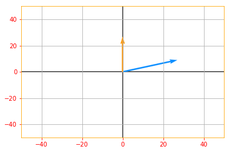
</ResultToggle>

### 02.12 - Example: Principal Components Analysis

PCA is a complexity reduction technique that tries to reduce a set of variables down to a smaller set of components that represent most of the information in the variables. This can be thought of as for a collection of data points applying lossy compression, meaning storing the points in a way that require less memory by trading some precision. At a conceptual level, PCA works by identifying sets of variables that share variance, and creating a component to represent that variance.

Earlier, when we were doing transpose or the matrix inverse, we relied on using Tensorflow's built in functions but for PCA, there is no such function, except one in the Tensorflow Extended (tft).

There are multiple ways you can implement a PCA in Tensorflow but since this algorithm is such an important one in the machine learning world, we will take the long route.

The reason for having PCA under Linear Algebra is to show that PCA could be implemented using the theorems we studied in this Chapter.

```python
# To start working with PCA, let's start by creating a 2D data set

x_data = tf.multiply(5, tf.random.uniform([100], minval=0, maxval=100, dtype = tf.float32, seed = 0))
y_data = tf.multiply(2, x_data) + 1 + tf.random.uniform([100], minval=0, maxval=100, dtype = tf.float32, seed = 0)

X = tf.stack([x_data, y_data], axis=1)

plt.rc_context({'axes.edgecolor':'orange', 'xtick.color':'red', 'ytick.color':'red'})
plt.plot(X[:,0], X[:,1], '+', color='b')
plt.grid()
```

<ResultToggle>
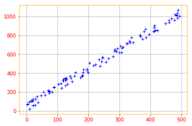
</ResultToggle>

We start by standardizing the data. Even though the data we created are on the same scales, its always a good practice to start by standardizing the data because most of the time the data you will be working with will be in different scales.

```python
def normalize(data):
    # creates a copy of data
    X = tf.identity(data)
    # calculates the mean
    X -=tf.reduce_mean(data, axis=0)
    return X

normalized_data = normalize(X)
plt.plot(normalized_data[:,0], normalized_data[:,1], '+', color='b')
plt.grid()
```

<ResultToggle>
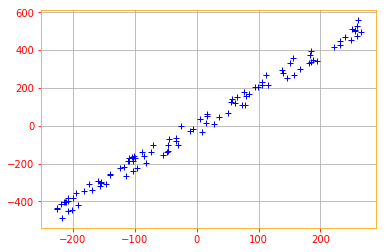
</ResultToggle>

Recall that PCA can be thought of as applying lossy compression to a collection of <MathInline formula={String.raw`x`} /> data points. The way we can minimize the loss of precision is by finding some decoding function <MathInline formula={String.raw`f(x) \approx c`} /> where <MathInline formula={String.raw`c`} /> will be the corresponding vector.

PCA is defined by our choice of this decoding function. Specifically, to make the decoder very simple, we chose to use matrix multiplication to map <MathInline formula={String.raw`c`} /> and define <MathInline formula={String.raw`g(c) = Dc`} />. Our goal is to minimize the distance between the input point <MathInline formula={String.raw`x`} /> to its reconstruction and to do that we use <MathInline formula={String.raw`L^2`} /> norm. Which boils down to our encoding function <MathBlock formula={String.raw`c = D^{\top} x`} />.

Finally, to reconstruct the PCA we use the same matrix <MathInline formula={String.raw`D`} /> to decode all the points and to solve this optimization problem, we use eigendecomposition.

Please note that the following equation is the final version of a lot of matrix transformations. I don't provide the derivatives because the goal is to focus on the mathematical implementation, rather than the derivation. But for the curious, You can read about the derivation in [Chapter 2 Section 11](https://www.deeplearningbook.org/contents/linear_algebra.html).

<MathBlock formula={String.raw`d^* = argmax_d \ Tr(d^{\top} X^{\top} Xd) \ \text{subject to} \ dd^{\top} = 1 \tag{31}`} />

To find <MathInline formula={String.raw`d`} /> we can calculate the eigenvectors <MathInline formula={String.raw`X^TX`} />.

```python
# Finding the Eigne Values and Vectors for the data
eigen_values, eigen_vectors = tf.linalg.eigh(tf.tensordot(tf.transpose(normalized_data), normalized_data, axes=1))

print("Eigen Vectors: \n{} \nEigen Values: \n{}".format(eigen_vectors, eigen_values))
```

<ResultToggle>
```python
Eigen Vectors:
[[-0.8908606  -0.45427683]
[ 0.45427683 -0.8908606 ]]
Eigen Values:
[   16500.715 11025234.   ]
```
</ResultToggle>

The eigenvectors (principal components) determine the directions of the new feature space, and the eigenvalues determine their magnitude.

Now, let's use these Eigenvectors to rotate our data. The goal of the rotation is to end up with a new coordinate system where data is uncorrelated and thus where the basis axes gather all the variance. Thereby reducing the dimension.

Recall our encoding function <MathBlock formula={String.raw`c = D^{\top} x`} />, where <MathInline formula={String.raw`D`} /> is the matrix containing the eigenvectors that we have calculated before.

```python
X_new = tf.tensordot(tf.transpose(eigen_vectors), tf.transpose(normalized_data), axes=1)

plt.plot(X_new[0, :], X_new[1, :], '+', color='b')
plt.xlim(-500, 500)
plt.ylim(-700, 700)
plt.grid()
```

<ResultToggle>
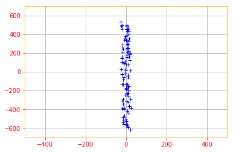
</ResultToggle>

That is the transformed data and that's it folks for our chapter on Linear Algebra 😉.


## 💫 Congratulations

You have successfully completed Chapter 2 Linear algebra of [Deep Learning with Tensorflow 2.0](https://www.adhiraiyan.org/DeepLearningWithTensorflow.html). To recap, we went through the following concepts:

- Scalars, Vectors, Matrices and Tensors
- Multiplying Matrices and Vectors
- Identity and Inverse Matrices
- Linear Dependence and Span
- Norms
- Special Kinds of Matrices and Vectors
- Eigendecomposition
- Singular Value Decomposition
- The Moore-Penrose Pseudoinverse
- The Trace Operator
- The Determinant
- Example: Principal Components Analysis

We covered a lot of content in one notebook, like I mentioned in the begining, this is not meant to be an absolute beginner or a comprehensive chapter on Linear Algebra, our focus is Deep Learning with Tensorflow, so we only went through the material we need to understand Deep Learning.

I tried to minimize the mathematics and focus more on the implementation side but if you like to study linear algebra on all of it's glory, or just want to read more about few sections take a look at [Linear Algebra by Jim Hefferon](http://joshua.smcvt.edu/linearalgebra/book.pdf) or [A First Course in Linear Algebra by Robert A. Beezer](http://linear.ups.edu/download/fcla-3.40-tablet.pdf).

🔥 You can access the Code for this notebook in [GitHub](https://github.com/adhiraiyan/DeepLearningWithTF2.0) or launch an executable versions using [Google Colab](https://colab.research.google.com/github/adhiraiyan/DeepLearningWithTF2.0/blob/master/notebooks/02.00-Linear-Algebra.ipynb) or view it in [Jupyter nbviewer](https://nbviewer.jupyter.org/github/adhiraiyan/DeepLearningWithTF2.0/blob/master/notebooks/02.00-Linear-Algebra.ipynb). 🔥

<Newsletter />
